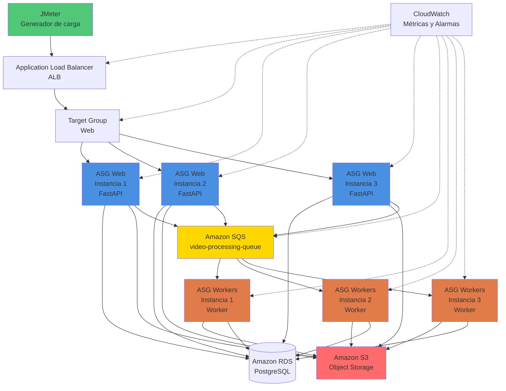

# 🧪 Plan de Análisis de Capacidad

## 1. Objetivo General

Evaluar la **capacidad máxima** que puede soportar la aplicación en sus dos componentes críticos:

1. **Capa Web (API HTTP):** endpoints de la API REST
2. **Capa Worker:** procesamiento asíncrono de videos con FFmpeg

El propósito es identificar límites de **concurrencia, rendimiento y estabilidad**, establecer una línea base de desempeño y proponer acciones de mejora basadas en evidencia.

---

## 2. Objetivos Específicos

| Nº | Objetivo | Métrica asociada |
|----|-----------|------------------|
| 1 | Determinar el número máximo de usuarios concurrentes soportados en la API sin degradación | p95 ≤ 1s, error rate ≤ 5% |
| 2 | Medir la capacidad de procesamiento de los workers (videos/minuto) | Throughput y tiempo medio de servicio |
| 3 | Identificar cuellos de botella en CPU, memoria, red o almacenamiento | Métricas del host y contenedores |
| 4 | Evaluar la estabilidad bajo carga sostenida y picos repentinos | Desviación estándar de latencia y uso de recursos |
| 5 | Validar el tiempo de respuesta de endpoints bajo diferentes cargas | Tiempo de respuesta p95, p99 bajo carga variable |
| 6 | Documentar resultados y recomendaciones de escalabilidad | Informe final con evidencias y gráficos |

---

## 3. Descripción General

Este plan de pruebas evalúa dos componentes críticos de la arquitectura:

### 3.1 Capa Web (API HTTP)

- **Endpoints bajo prueba:** `POST /api/auth/login`
- **Función:** Autenticación de usuarios mediante validación de credenciales
- **Tecnología:** FastAPI (Python), almacenamiento S3, mensajería SQS
- **Métricas clave:** Latencia (p50, p95, p99), RPS, concurrencia máxima, error rate

### 3.2 Capa Worker

- **Función:** Procesamiento asíncrono de videos con FFmpeg (branding, trim, concatenación)
- **Tecnología:** Python, SQS Consumer, FFmpeg, S3
- **Métricas clave:** Videos procesados/minuto, tiempo medio de procesamiento, throughput

Las pruebas se ejecutarán en **entorno AWS** con **Application Load Balancer**, **Auto Scaling Groups** y **Amazon SQS**, garantizando un entorno de producción realista y escalable.

---

## 4. Tipos de Pruebas

### 4.1 Escenario 1 - Capa Web

- **Sanidad (Smoke):** 5 usuarios durante 1 minuto para validar que todo responde y la telemetría está activa
- **Escalamiento rápido (Ramp):** iniciar en 0 y aumentar hasta X usuarios en 3 minutos; mantener 5 minutos. Repetir con X creciente (p. ej., 100 → 200 → 300) hasta observar degradación
- **Sostenida corta:** ejecutar 5 minutos en el 80% de X (el mejor nivel previo sin degradación) para confirmar estabilidad

### 4.2 Plan B - Capa Worker

- **Pruebas de saturación:** subir la cantidad de tareas progresivamente en la cola
- **Pruebas sostenidas:** mantener un número fijo de archivos en la cola que no la sature

---

## 5. Criterios de Aceptación

### 5.1 Capa Web

- ✅ **p95 de latencia ≤ 1 segundo**
- ✅ **Error rate ≤ 5%** (excluyendo errores esperados como 401 para credenciales inválidas)
- ✅ **Sin resets ni timeouts anómalos**
- ✅ **CPU de instancias EC2 ≤ 85%** sostenido
- ✅ **Tiempo de respuesta consistente:** Latencia estable independientemente del número de usuarios concurrentes
- ✅ **Validación de errores controlados:**
  - 401 para credenciales inválidas o incorrectas
  - 422 para datos de entrada mal formateados

### 5.2 Capa Worker

- ✅ **La cola no debe crecer indefinidamente** durante prueba sostenida
- ✅ **Throughput estable** según configuración de paralelismo
- ✅ **CPU de instancias worker ≤ 85%** sostenido
- ✅ **Sin fallos de procesamiento** por timeout o recursos
- ✅ **Tiempo de procesamiento predecible** según tamaño de archivo

---

## 6. Datos de Prueba

### 6.1 Para Capa Web

- **Usuarios simulados:** 5, 50, 100, 200, 300, 400
- **Duración por escenario:** 1–10 minutos
- **Credenciales válidas:** Usuario de prueba pre-creado (test@example.com / pass123)
- **Credenciales inválidas:** Para pruebas de error (usuario inexistente, contraseña incorrecta)
- **Payload de login:** JSON con email y contraseña

### 6.2 Para Capa Worker

- **Mensajes en cola:** 10 a 500 por ejecución
- **Tamaños de video:** 50 MB, 100 MB
- **Configuraciones de paralelismo:** 1, 2, 4 workers (instancias)
- **Operaciones FFmpeg:** Intro (2.5s) + Video (max 30s) + Outro (2.5s)

---

## 7. Escenarios de Prueba

### 7.1 Escenario 1 - Capacidad de la Capa Web (Usuarios Concurrentes)

**Objetivo:** Determinar el número de usuarios concurrentes (y RPS asociado) que la API soporta cumpliendo SLOs, sin estar limitado por la capa asíncrona.

#### Estrategia de Implementación

- **Desacoplar la capa worker:** en endpoints de carga, devolver 202 y redirigir a un mock de cola que acepte mensajes en memoria y responda instantáneamente.

#### Escenarios de Prueba

1. **Sanidad (Smoke):** 5 usuarios durante 1 minuto para validar que todo responde y la telemetría está activa.

2. **Escalamiento rápido (Ramp):** iniciar en 0 y aumentar hasta X usuarios en 3 minutos; mantener 5 minutos. Repetir con X creciente (p. ej., 100 → 200 → 300) hasta observar degradación.

3. **Sostenida corta:** ejecutar 5 minutos en el 80% de X (el mejor nivel previo sin degradación) para confirmar estabilidad.

#### Criterios de Éxito/Fallo

**Capacidad máxima:** mayor número de usuarios concurrentes que cumple:
- ✅ **p95 de endpoints ≤ 1 s**
- ✅ **Errores (4xx evitables/5xx) ≤ 5%**
- ✅ **Sin resets/timeouts anómalos** ni throttling del almacenamiento

**Si se supera capacidad máxima:** registrar el primer KPI que se degrada (CPU del API, ancho de banda, etc) y usarlo como guía de mejora.

#### Herramientas Sugeridas

- **Generador:** JMeter
- **Observabilidad:** Prometheus/Grafana + APM (OpenTelemetry)

#### Salidas Esperadas

- Curva usuarios→latencia/errores
- RPS sostenido a capacidad máxima (ej: "Soporta 450 usuarios concurrentes con 320 RPS manteniendo p95 1,0 s")
- Bottlenecks con evidencias (CPU 90% en API, saturación de ancho de banda de subida, etc.)

---

### 7.2 Plan B — Rendimiento de la Capa Worker (Videos/min)

**Objetivo:** Medir cuántos videos por minuto procesa el/los worker(s) a distintos niveles de paralelismo y tamaños de archivo.

#### Estrategia de Implementación

- **Bypass de la web:** inyectar directamente mensajes en la cola (script/productor) con payloads realistas (rutas a archivos en storage de pruebas).

#### Diseño Experimental

- **Tamaño de video:** 50 MB, 100 MB
- **Concurrencia de worker:** 1, 2, 4 procesos/hilos por nodo

Para cada combinación:
- **Ejecutar pruebas de saturación:** subir la cantidad de tareas progresivamente en la cola
- **Ejecutar pruebas sostenidas:** mantener un número fijo de archivos en la cola que no la sature

#### Métricas y Cálculos

- **Throughput observado:** X = videos procesados por minuto
- **Tiempo medio de servicio:** S = tiempo_proceso_promedio por video

#### Criterios de Éxito/Fallo

- ✅ **Capacidad nominal:** (videos/min)
- ✅ **Estabilidad:** cola no crece sin control (tendencia ~0) durante la prueba

#### Herramientas Sugeridas

- **Productor de mensajes:** scripts Python/Go contra Redis/RabbitMQ/SQS
- **Trazabilidad de jobs:** IDs correlacionados (enqueue→start→end)
- **Perfilado del worker:** métricas (CPU, IO, red, etc)

#### Salidas Esperadas

- Tabla de capacidad por tamaño y configuración (ej: "1 nodos × 4 hilos → 18.5 videos/min a 200 MB")
- Puntos de saturación y cuellos de botella (CPU, decodificación, ancho de banda, temp disk)

---

## 8. Métricas a Capturar

### 8.1 Métricas de Aplicación (Capa Web)

| Categoría | Métrica | Descripción | Unidad |
|-----------|---------|-------------|--------|
| **Latencia** | p50, p90, p95, p99 | Percentiles de tiempo de respuesta | ms |
| **Throughput** | RPS (Requests Per Second) | Solicitudes procesadas por segundo | req/s |
| **Errores** | Error Rate | Porcentaje de respuestas 4xx/5xx | % |
| **Disponibilidad** | Uptime | Tiempo sin errores 5xx | % |
| **Capacidad** | Max VUs | Usuarios concurrentes máximos sin degradación | usuarios |

### 8.2 Métricas de Worker

| Métrica | Descripción | Unidad |
|---------|-------------|--------|
| **Videos procesados/min** | Throughput del worker | videos/min |
| **Tiempo medio de procesamiento** | Tiempo promedio por video | segundos |
| **Tiempo por fase** | DB Fetch, S3 Download, FFmpeg, DB Update | segundos |
| **Cola pendiente** | Mensajes en espera en la cola | mensajes |
| **Error rate** | Fallos de procesamiento | % |

### 8.3 Métricas de Infraestructura

| Recurso | Métricas | Herramienta |
|---------|----------|-------------|
| **CPU** | Utilización %, carga promedio | CloudWatch, docker stats, monitor.sh |
| **Memoria** | Uso MB, porcentaje, swap | CloudWatch, docker stats |
| **Red** | Ancho de banda (NetIO) | CloudWatch, docker stats |
| **Disco** | IO (BlockIO), espacio usado | CloudWatch, docker stats, df -h |
| **Base de datos** | Conexiones activas, latencia de consultas | CloudWatch, logs de RDS |

---

## 9. Configuración del Sistema

### 9.1 Arquitectura



### 9.2 Componentes de Despliegue

La aplicación está desplegada en AWS con los siguientes componentes:

- **Application Load Balancer (ALB):** Punto de entrada público, recibe todas las peticiones y las enruta al Target Group
- **Target Group (Web):** Agrupa las instancias sanas de la capa web y define health checks
- **Auto Scaling Group (Web):** Conjunto de instancias EC2 que ejecutan la API FastAPI. Escala en base a métricas de CloudWatch (CPU, peticiones por target, errores 5xx)
- **Auto Scaling Group (Workers):** Grupo de instancias EC2 que ejecutan los workers de procesamiento de video. Escala por profundidad de cola y/o edad de mensajes en SQS
- **Amazon SQS (video-processing-queue):** Recibe eventos de procesamiento emitidos por la API. Los workers consumen mensajes de aquí
- **Amazon S3:** Almacenamiento en la nube. Guarda los videos subidos y los procesados en carpetas separadas (`/videos/uploaded` y `/videos/processed`)
- **Amazon RDS (PostgreSQL):** Base de datos relacional que guarda toda la información estructurada del sistema
- **Amazon CloudWatch + Alarms:** Recopila métricas del ALB, Target Group, ASG y SQS. Dispara escalado en ambos ASG (Web/Workers)

---

### 10.2 Inyección de Mensajes en Cola

#### Ejecución con Diferentes Configuraciones

```bash
# Configurar autoscaling para 1 worker
# Ejecutar script de inyección
python worker_load_test.py --count 5

# Configurar autoscaling para 2 workers
# Ejecutar script de inyección
python worker_load_test.py --count 10

# Configurar autoscaling para 3 workers
# Ejecutar script de inyección
python worker_load_test.py --count 16

# Repetir con tamaño 100 MB
```

---