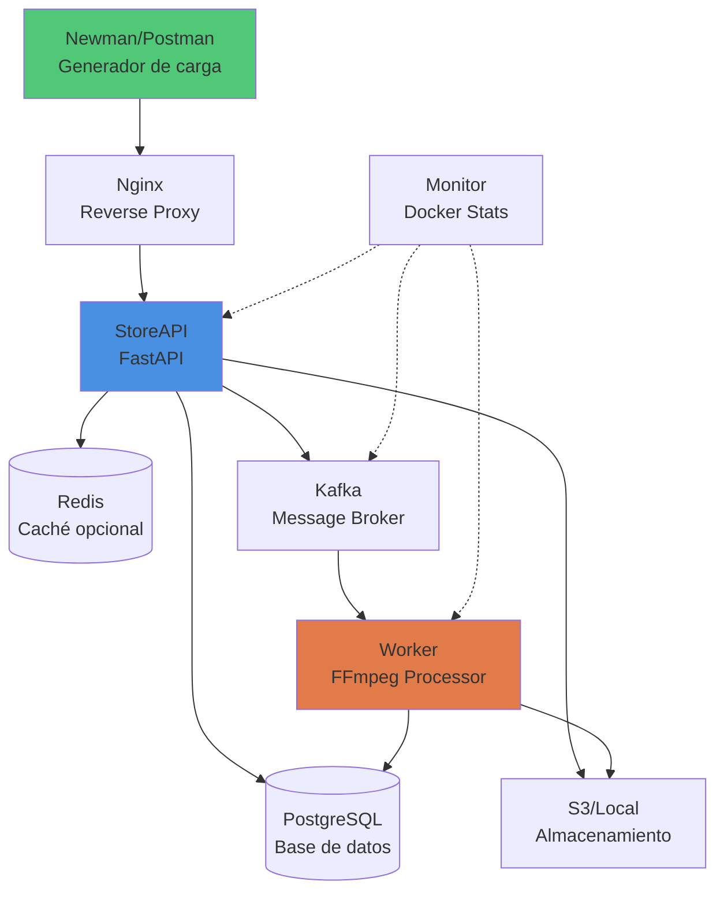

# 🧪 Plan de Análisis de Capacidad

## 1. Objetivo General

Evaluar la **capacidad máxima** que puede soportar la aplicación en sus dos componentes críticos:
1. **Capa Web (API HTTP):** endpoint de subida de videos `/api/videos/upload`
2. **Capa Worker:** procesamiento asíncrono de videos con FFmpeg

El propósito es identificar límites de **concurrencia, rendimiento y estabilidad**, establecer una línea base de desempeño y proponer acciones de mejora basadas en evidencia.

---

## 2. Objetivos Específicos

| Nº | Objetivo | Métrica asociada |
|----|-----------|------------------|
| 1 | Determinar el número máximo de usuarios concurrentes soportados en upload sin degradación | p95 ≤ 1s, error rate ≤ 5% |
| 2 | Medir la capacidad de procesamiento de los workers (videos/minuto) | Throughput y tiempo medio de servicio |
| 3 | Identificar cuellos de botella en CPU, memoria, red o almacenamiento | Métricas del host y contenedores |
| 4 | Evaluar la estabilidad bajo carga sostenida y picos repentinos | Desviación estándar de latencia y uso de recursos |
| 5 | Validar el tiempo de aceptación de archivos de diferentes tamaños | Tiempo de respuesta para 5 MB, 50 MB, 100 MB |
| 6 | Documentar resultados y recomendaciones de escalabilidad | Informe final con evidencias y gráficos |

---

## 3. Descripción General

Este plan de pruebas evalúa dos componentes críticos de la arquitectura:

### 3.1 Capa Web (API HTTP)
- **Endpoint bajo prueba:** `POST /api/videos/upload`
- **Función:** Recepción de archivos multipart/form-data, validación, almacenamiento temporal y encolado de tarea
- **Tecnología:** FastAPI (Python), almacenamiento S3/local, mensajería Kafka
- **Métricas clave:** Tiempo de aceptación, RPS, concurrencia máxima, error rate

### 3.2 Capa Worker
- **Función:** Procesamiento asíncrono de videos con FFmpeg (branding, trim, concatenación)
- **Tecnología:** Python, Kafka Consumer, FFmpeg, S3
- **Métricas clave:** Videos procesados/minuto, tiempo medio de procesamiento, throughput

Las pruebas se ejecutarán en **entorno local** con **Docker Compose**, garantizando un aislamiento controlado y replicable del sistema.

---

## 4. Tipos de Pruebas

| Tipo | Objetivo | Descripción |
|------|----------|-------------|
| **Capacidad** | Determinar máximo de usuarios concurrentes y RPS sostenido | Incremento progresivo de carga hasta detectar degradación |
| **Carga** | Evaluar comportamiento con niveles crecientes de solicitudes | Rampas ascendentes con plateaus de estabilización |
| **Estrés** | Analizar respuesta ante sobrecarga extrema | Incremento súbito hasta saturación y observar recuperación |
| **Picos (Spike)** | Evaluar recuperación tras picos repentinos | Carga instantánea 10x–20x durante 20–30s |
| **Sostenida (Soak)** | Validar estabilidad a largo plazo | 1–2 horas a carga media para detectar fugas |
| **Escalabilidad Worker** | Validar impacto de aumentar paralelismo | Comparar throughput con 1/2/4 workers |

---

## 5. Criterios de Aceptación

### 5.1 Capa Web (Upload)
- ✅ **p95 de latencia ≤ 1 segundo** para archivos de hasta 100 MB
- ✅ **Error rate ≤ 5%** (excluyendo errores esperados como 400/413)
- ✅ **Sin resets ni timeouts anómalos**
- ✅ **CPU del contenedor `storeapi` ≤ 85%** sostenido
- ✅ **Tiempo de aceptación:**
  - 5 MB: ≤ 500 ms
  - 50 MB: ≤ 1.5 s
  - 100 MB: ≤ 2 s
- ✅ **Validación de errores controlados:**
  - 400 para tipos de archivo inválidos
  - 413 para archivos que exceden límite configurado

### 5.2 Capa Worker
- ✅ **La cola no debe crecer indefinidamente** durante prueba sostenida
- ✅ **Throughput estable** según configuración de paralelismo
- ✅ **CPU del contenedor `worker` ≤ 85%** sostenido
- ✅ **Sin fallos de procesamiento** por timeout o recursos
- ✅ **Tiempo de procesamiento predecible** según tamaño de archivo

---

## 6. Datos de Prueba

### 6.1 Para Capa Web
- **Usuarios simulados:** 5, 50, 100, 200, 300, 400
- **Duración por escenario:** 1–10 minutos
- **Tamaños de archivo:** 5 MB, 50 MB, 100 MB
- **Formato de archivos:** MP4 (válidos) y archivos inválidos para pruebas de error
- **Credenciales:** Usuario de prueba pre-creado (test@example.com / pass123)

### 6.2 Para Capa Worker
- **Mensajes en cola:** 10 a 500 por ejecución
- **Tamaños de video:** 50 MB, 100 MB
- **Configuraciones de paralelismo:** 1, 2, 4 workers
- **Operaciones FFmpeg:** Intro (2.5s) + Video (max 30s) + Outro (2.5s)

---

## 7. Iteraciones y Repetibilidad

- Cada escenario se repetirá **mínimo 5 veces** para validar consistencia
- Se calcularán: **promedio, desviación estándar y percentiles** (p50, p90, p95, p99)
- Se identificarán y justificarán **valores atípicos**
- Se mantendrá un **baseline** por iteración del desarrollo para comparación

---

## 8. Configuración del Sistema

### 8.1 Arquitectura



### 8.2 Servicios Docker Compose

| Servicio | Imagen/Tecnología | Propósito |
|----------|-------------------|-----------|
| `nginx` | nginx:latest | Proxy reverso y balanceo de carga |
| `storeapi` | FastAPI (Python 3.11) | API REST para manejo de videos |
| `worker` | Python 3.11 + FFmpeg | Procesamiento asíncrono de videos |
| `anb-database` | PostgreSQL 15 | Persistencia de metadatos |
| `anb-redis` | Redis 7 | Caché (opcional) |
| `kafka` | Apache Kafka | Cola de mensajes para tareas |

### 8.3 Host Local (Requisitos Mínimos)

- **CPU:** 8 núcleos (mínimo 4 dedicados a Docker)
- **RAM:** 16 GB (mínimo 8 GB disponibles)
- **Disco:** 50 GB libres (para videos y logs)
- **Sistema operativo:** macOS / Linux
- **Docker:** Docker Desktop 4.x o Docker Engine 20.x

---

## 9. Herramientas de Prueba

| Herramienta | Uso | Versión | Comando de instalación |
|-------------|-----|---------|------------------------|
| **Newman** | Ejecución automatizada de colecciones Postman | 5.6.3+ | `npm install -g newman` |
| **Postman** | Diseño de colecciones y verificación manual | Última | Descargar de postman.com |
| **Docker Stats** | Monitoreo de recursos de contenedores | Built-in | - |
| **monitor.sh** | Script personalizado para captura de métricas | Custom | Incluido en el proyecto |
| **Python 3.11** | Inyección de mensajes en Kafka (worker tests) | 3.11+ | - |
| **jq** | Procesamiento de logs JSON | Última | `brew install jq` |

---

## 10. Métricas

### 10.1 Métricas de Aplicación

| Categoría | Métrica | Descripción | Unidad |
|-----------|---------|-------------|--------|
| **Latencia** | p50, p90, p95, p99 | Percentiles de tiempo de respuesta | ms |
| **Throughput** | RPS (Requests Per Second) | Solicitudes procesadas por segundo | req/s |
| **Errores** | Error Rate | Porcentaje de respuestas 4xx/5xx | % |
| **Disponibilidad** | Uptime | Tiempo sin errores 5xx | % |
| **Capacidad** | Max VUs | Usuarios concurrentes máximos sin degradación | usuarios |

### 10.2 Métricas de Worker

| Métrica | Descripción | Unidad |
|---------|-------------|--------|
| **Videos procesados/min** | Throughput del worker | videos/min |
| **Tiempo medio de procesamiento** | Tiempo promedio por video | segundos |
| **Tiempo por fase** | DB Fetch, S3 Download, FFmpeg, DB Update | segundos |
| **Cola pendiente** | Mensajes en espera en Kafka | mensajes |
| **Error rate** | Fallos de procesamiento | % |

### 10.3 Métricas de Infraestructura

| Recurso | Métricas | Herramienta |
|---------|----------|-------------|
| **CPU** | Utilización %, carga promedio | docker stats, monitor.sh |
| **Memoria** | Uso MB, porcentaje, swap | docker stats |
| **Red** | Ancho de banda (NetIO) | docker stats |
| **Disco** | IO (BlockIO), espacio usado | docker stats, df -h |
| **Base de datos** | Conexiones activas, latencia de consultas | Logs de PostgreSQL |

---

## 11. Escenarios de Prueba

### 11.1 Escenario 1: Capacidad de la Capa Web (Upload)

**Objetivo:** Determinar el máximo de usuarios concurrentes y RPS que soporta `POST /api/videos/upload` cumpliendo SLOs.

**Estrategia:**
1. **Smoke Test:** 5 VUs durante 1 minuto (validación básica)
2. **Ramp Test:** Incremento gradual 0 → X VUs en 3 minutos, mantener 5 minutos
3. **Capacity Test:** Encontrar X máximo donde p95 ≤ 1s y error rate ≤ 5%
4. **Sustained Test:** 5 minutos al 80% de X para validar estabilidad

**Configuración Newman:**
```bash
# Smoke test (5 usuarios, 60 iteraciones total)
newman run postman/collection.json \
  -e postman/environment.json \
  --iteration-count 60 \
  --delay-request 1000 \
  -r cli,html \
  --reporter-html-export postman/report_smoke.html

# Ramp test (incremento gradual simulado con múltiples ejecuciones)
for users in 50 100 150 200 250 300; do
  echo "Testing with $users users..."
  newman run postman/collection.json \
    -e postman/environment.json \
    --iteration-count $users \
    --delay-request 200 \
    -r cli,html \
    --reporter-html-export postman/report_${users}users.html
  sleep 30  # pausa entre escalones
done
```

**Criterios de éxito:**
- ✅ p95 ≤ 1s
- ✅ Error rate ≤ 5% (excluyendo 400/413 esperados)
- ✅ CPU API ≤ 85%
- ✅ Sin resets/timeouts anómalos

**Salidas esperadas:**
- Curva: Usuarios concurrentes vs. p95 latencia
- Gráfico: RPS vs. Error rate
- Identificación de capacidad máxima
- Reporte HTML de Newman con estadísticas detalladas

---

### 11.2 Escenario 2: Rendimiento de la Capa Worker

**Objetivo:** Medir videos/min procesados a distintos tamaños y niveles de paralelismo.

**Estrategia:**
1. **Bypass de la capa web:** Inyectar mensajes directamente en Kafka topic `video_tasks`
2. **Variables experimentales:**
   - Tamaños: 50 MB, 100 MB
   - Paralelismo: 1, 2, 4 workers
3. **Medición:** Saturación (aumentar tareas) y sostenida (mantener backlog fijo)

**Inyección de mensajes (Python script):**
```python
# worker_load_test.py
from confluent_kafka import Producer
import json
import time

producer = Producer({'bootstrap.servers': 'localhost:9092'})

# Inyectar 100 tareas
for i in range(100):
    message = {
        'task_id': f'test-task-{i}',
        'video_id': 1,  # ID de video existente en DB
    }
    producer.produce('video_tasks', json.dumps(message))
    if i % 10 == 0:
        print(f'Enqueued {i} tasks...')
        time.sleep(1)  # control de ritmo

producer.flush()
print('All tasks enqueued!')
```

**Ejecución:**
```bash
# Con 1 worker (default)
docker-compose up -d worker

# Con 2 workers
docker-compose up -d --scale worker=2

# Con 4 workers
docker-compose up -d --scale worker=4

# Inyectar carga
python worker_load_test.py

# Monitorear procesamiento
docker logs -f worker | grep "TOTAL TASK TIME"
```

**Métricas a calcular:**
- Videos procesados/minuto = (Total videos / Tiempo total en min)
- Tiempo medio de servicio = Promedio de "TOTAL TASK TIME"
- Descomposición: DB Fetch, S3 Download, FFmpeg, DB Update
- Pendiente de la cola = Mensajes encolados - Mensajes procesados

**Criterios de éxito:**
- ✅ Capacidad nominal estable (throughput constante)
- ✅ Cola no crece indefinidamente (pendiente ≈ 0 en sostenidas)
- ✅ CPU worker ≤ 85%
- ✅ Sin errores de procesamiento

**Salidas esperadas:**
- Tabla: Capacidad por configuración (1/2/4 workers) y tamaño (50/100 MB)
- Gráfico: Throughput vs. Paralelismo
- Identificación de cuellos de botella (CPU, IO, S3, DB)

---

## 12. Ejecución de Pruebas con Makefile

El proyecto incluye un `Makefile` con comandos automatizados para facilitar la ejecución de pruebas.

### 12.1 Comandos Disponibles

```bash
# Levantar toda la infraestructura
make up

# Ver estado de los contenedores
make ps

# Ejecutar colección de Newman (pruebas de upload)
make newman

# Ejecutar con monitoreo de recursos
make newman-with-monitor

# Iniciar monitoreo manual
make monitor-start

# Detener monitoreo manual
make monitor-stop

# Apagar todo y limpiar
make down
```

### 12.2 Flujo de Ejecución Completo

**Paso 1: Preparación del entorno**
```bash
# 1. Levantar servicios
make up

# 2. Verificar que todos los servicios estén corriendo
make ps

# Salida esperada:
# NAME                 STATUS              PORTS
# storeapi             Up 30 seconds       0.0.0.0:8000->8000/tcp
# worker               Up 30 seconds       
# nginx                Up 30 seconds       0.0.0.0:80->80/tcp
# anb-database         Up 30 seconds       5432/tcp
# kafka                Up 30 seconds       9092/tcp
# anb-redis            Up 30 seconds       6379/tcp

# 3. Verificar logs (opcional)
docker logs storeapi --tail 50
docker logs worker --tail 50
```

**Paso 2: Crear usuario de prueba**
```bash
# Desde Postman o curl
curl -X POST http://localhost/api/auth/signup \
  -H "Content-Type: application/json" \
  -d '{
    "email": "test@example.com",
    "password": "pass123"
  }'

# Verificar creación (debe retornar 201)
```

**Paso 3: Ejecutar pruebas con monitoreo**
```bash
# Ejecución automatizada con captura de métricas
make newman-with-monitor

# Esto ejecuta:
# 1. Inicia monitor.sh en background (captura CPU/Mem cada 1s)
# 2. Ejecuta newman con la colección
# 3. Detiene el monitor
# 4. Genera reporte HTML en postman/report.html
```

**Paso 4: Análisis de resultados**

**Reporte de Newman:**
```bash
# Abrir reporte HTML
open postman/report.html  # macOS
xdg-open postman/report.html  # Linux

# Contenido del reporte:
# - Total de requests ejecutados
# - Distribución de códigos de respuesta (200, 201, 400, 413)
# - Tiempos de respuesta: min, max, avg, p95
# - Tests pasados/fallados
# - Timeline de ejecución
```

**Paso 5: Monitoreo interactivo**

Durante las pruebas, puedes usar el script `monitor.sh` para observar recursos en tiempo real:

```bash
# Modo interactivo con menú
./monitor.sh

# Opciones:
# 1) Show real-time stats (streaming)     <- Ver recursos en vivo
# 2) Show snapshot (one-time)              <- Captura puntual
# 3) Show worker processing times          <- Logs de worker
# 4) Show all (snapshot + worker times)    <- Todo junto
# 5) Exit

# Modo directo (sin menú)
./monitor.sh --stream          # Streaming en tiempo real
./monitor.sh --snapshot        # Captura única
./monitor.sh --worker          # Solo logs de worker
```

### 12.3 Resultados Esperados por Escenario

**Escenario 1: Upload con 50 usuarios concurrentes**
```
Archivo: postman/report_50users.html

Métricas esperadas:
├─ Total requests: 50
├─ Success rate: 95-100%
├─ p95 latency: 500-800ms (5MB), 1-1.5s (50MB)
├─ Códigos HTTP:
│  ├─ 201 Created: 47-50 (95-100%)
│  ├─ 400 Bad Request: 0-2 (0-4%)
│  └─ 413 Payload Too Large: 0-1 (0-2%)
└─ Duration: ~2-3 minutos

Recursos (cpu_stats_newman.log):
├─ storeapi CPU: 40-60% promedio, picos de 75%
├─ worker CPU: 15-25% (si hay procesamiento concurrente)
├─ nginx CPU: 5-10%
└─ Database CPU: 10-15%
```

**Escenario 2: Upload con 200 usuarios concurrentes**
```
Archivo: postman/report_200users.html

Métricas esperadas:
├─ Total requests: 200
├─ Success rate: 90-95%
├─ p95 latency: 900-1200ms (puede degradarse)
├─ Códigos HTTP:
│  ├─ 201 Created: 180-190 (90-95%)
│  ├─ 400/413: 5-10 (2.5-5%)
│  └─ 500/502/503: 0-10 (0-5%)
└─ Duration: ~5-8 minutos

Recursos:
├─ storeapi CPU: 70-85% promedio, picos de >90% ⚠️
├─ worker CPU: 30-50%
├─ Posibles cuellos de botella:
│  ├─ CPU de storeapi (considerar escalado)
│  ├─ Ancho de banda de red
│  └─ Latencia de escritura en S3/local
```

**Escenario 3: Worker con 100 videos (50MB, 2 workers)**
```
Logs: docker logs worker

Métricas esperadas:
├─ Videos procesados: 100
├─ Throughput: 3-5 videos/min por worker (6-10 total)
├─ Tiempo promedio: 12-18 segundos/video
├─ Descomposición:
│  ├─ DB Fetch: 0.1-0.2s (despreciable)
│  ├─ S3 Download: 2-4s (dependiente de red)
│  ├─ FFmpeg: 10-14s (80-85% del tiempo)
│  └─ DB Update: 0.3-0.6s
└─ Duración total: 10-17 minutos

Recursos:
├─ worker-1 CPU: 70-85%
├─ worker-2 CPU: 70-85%
├─ Cuello de botella principal: FFmpeg (CPU-bound)
└─ Recomendación: Escalar a 4 workers puede duplicar throughput
```

---

## 13. Riesgos y Limitaciones

### 13.1 Limitaciones del Entorno Local

- ⚠️ El hardware local puede diferir significativamente de un entorno productivo (CPU, IO, red)
- ⚠️ Docker Desktop en macOS/Windows introduce sobrecarga adicional comparado con Linux nativo
- ⚠️ Compartir recursos con otros procesos del sistema puede afectar resultados
- ⚠️ Almacenamiento local es más rápido que S3 real (puede enmascarar latencias)

### 13.2 Riesgos Identificados

| Riesgo | Impacto | Mitigación |
|--------|---------|------------|
| Hardware insuficiente causa fallos prematuros | Alto | Documentar specs y ajustar expectativas |
| Variabilidad entre ejecuciones por procesos background | Medio | Ejecutar 5+ iteraciones y promediar |
| Agotamiento de disco por videos acumulados | Medio | Limpiar `videos/` entre pruebas |
| Timeout de Kafka o DB por recursos | Alto | Monitorear logs y ajustar configuraciones |
| Newman no genera suficiente concurrencia | Medio | Ejecutar múltiples instancias en paralelo |