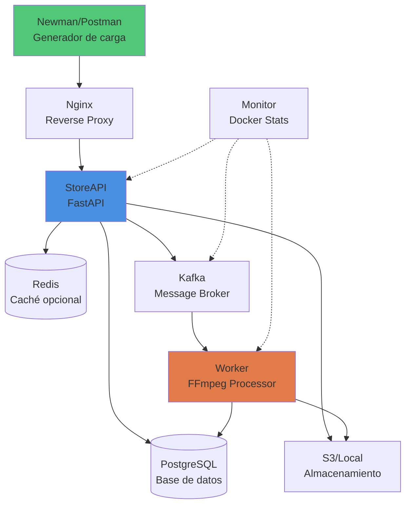

# 🧪 Plan de Análisis de Capacidad

## 1. Objetivo General

Evaluar la **capacidad máxima** que puede soportar la aplicación en sus dos componentes críticos:
1. **Capa Web (API HTTP):** endpoint de subida de videos `/api/videos/upload`
2. **Capa Worker:** procesamiento asíncrono de videos con FFmpeg

El propósito es identificar límites de **concurrencia, rendimiento y estabilidad**, establecer una línea base de desempeño y proponer acciones de mejora basadas en evidencia.

---

## 2. Objetivos Específicos

| Nº | Objetivo | Métrica asociada |
|----|-----------|------------------|
| 1 | Determinar el número máximo de usuarios concurrentes soportados en upload sin degradación | p95 ≤ 1s, error rate ≤ 5% |
| 2 | Medir la capacidad de procesamiento de los workers (videos/minuto) | Throughput y tiempo medio de servicio |
| 3 | Identificar cuellos de botella en CPU, memoria, red o almacenamiento | Métricas del host y contenedores |
| 4 | Evaluar la estabilidad bajo carga sostenida y picos repentinos | Desviación estándar de latencia y uso de recursos |
| 5 | Validar el tiempo de aceptación de archivos de diferentes tamaños | Tiempo de respuesta para 5 MB, 50 MB, 100 MB |
| 6 | Documentar resultados y recomendaciones de escalabilidad | Informe final con evidencias y gráficos |

---

## 3. Descripción General

Este plan de pruebas evalúa dos componentes críticos de la arquitectura:

### 3.1 Capa Web (API HTTP)
- **Endpoint bajo prueba:** `POST /api/videos/upload`
- **Función:** Recepción de archivos multipart/form-data, validación, almacenamiento temporal y encolado de tarea
- **Tecnología:** FastAPI (Python), almacenamiento S3/local, mensajería Kafka
- **Métricas clave:** Tiempo de aceptación, RPS, concurrencia máxima, error rate

### 3.2 Capa Worker
- **Función:** Procesamiento asíncrono de videos con FFmpeg (branding, trim, concatenación)
- **Tecnología:** Python, Kafka Consumer, FFmpeg, S3
- **Métricas clave:** Videos procesados/minuto, tiempo medio de procesamiento, throughput

Las pruebas se ejecutarán en **entorno local** con **Docker Compose**, garantizando un aislamiento controlado y replicable del sistema.

---

## 4. Tipos de Pruebas

| Tipo | Objetivo | Descripción |
|------|----------|-------------|
| **Capacidad** | Determinar máximo de usuarios concurrentes y RPS sostenido | Incremento progresivo de carga hasta detectar degradación |
| **Carga** | Evaluar comportamiento con niveles crecientes de solicitudes | Rampas ascendentes con plateaus de estabilización |
| **Estrés** | Analizar respuesta ante sobrecarga extrema | Incremento súbito hasta saturación y observar recuperación |
| **Picos (Spike)** | Evaluar recuperación tras picos repentinos | Carga instantánea 10x–20x durante 20–30s |
| **Sostenida (Soak)** | Validar estabilidad a largo plazo | 1–2 horas a carga media para detectar fugas |
| **Escalabilidad Worker** | Validar impacto de aumentar paralelismo | Comparar throughput con 1/2/4 workers |

---

## 5. Criterios de Aceptación

### 5.1 Capa Web (Upload)
- ✅ **p95 de latencia ≤ 1 segundo** para archivos de hasta 100 MB
- ✅ **Error rate ≤ 5%** (excluyendo errores esperados como 400/413)
- ✅ **Sin resets ni timeouts anómalos**
- ✅ **CPU del contenedor `storeapi` ≤ 85%** sostenido
- ✅ **Tiempo de aceptación:**
  - 5 MB: ≤ 500 ms
  - 50 MB: ≤ 1.5 s
  - 100 MB: ≤ 2 s
- ✅ **Validación de errores controlados:**
  - 400 para tipos de archivo inválidos
  - 413 para archivos que exceden límite configurado

### 5.2 Capa Worker
- ✅ **La cola no debe crecer indefinidamente** durante prueba sostenida
- ✅ **Throughput estable** según configuración de paralelismo
- ✅ **CPU del contenedor `worker` ≤ 85%** sostenido
- ✅ **Sin fallos de procesamiento** por timeout o recursos
- ✅ **Tiempo de procesamiento predecible** según tamaño de archivo

---

## 6. Datos de Prueba

### 6.1 Para Capa Web
- **Usuarios simulados:** 5, 50, 100, 200, 300, 400
- **Duración por escenario:** 1–10 minutos
- **Tamaños de archivo:** 5 MB, 50 MB, 100 MB
- **Formato de archivos:** MP4 (válidos) y archivos inválidos para pruebas de error
- **Credenciales:** Usuario de prueba pre-creado (test@example.com / pass123)

### 6.2 Para Capa Worker
- **Mensajes en cola:** 10 a 500 por ejecución
- **Tamaños de video:** 50 MB, 100 MB
- **Configuraciones de paralelismo:** 1, 2, 4 workers
- **Operaciones FFmpeg:** Intro (2.5s) + Video (max 30s) + Outro (2.5s)

---

## 7. Iteraciones y Repetibilidad

- Cada escenario se repetirá **mínimo 5 veces** para validar consistencia
- Se calcularán: **promedio, desviación estándar y percentiles** (p50, p90, p95, p99)
- Se identificarán y justificarán **valores atípicos**
- Se mantendrá un **baseline** por iteración del desarrollo para comparación

---

## 8. Configuración del Sistema

### 8.1 Arquitectura



### 8.2 Servicios Docker Compose

| Servicio | Imagen/Tecnología | Propósito |
|----------|-------------------|-----------|
| `nginx` | nginx:latest | Proxy reverso y balanceo de carga |
| `storeapi` | FastAPI (Python 3.11) | API REST para manejo de videos |
| `worker` | Python 3.11 + FFmpeg | Procesamiento asíncrono de videos |
| `anb-database` | PostgreSQL 15 | Persistencia de metadatos |
| `anb-redis` | Redis 7 | Caché (opcional) |
| `kafka` | Apache Kafka | Cola de mensajes para tareas |

### 8.3 Host Local (Requisitos Mínimos)

- **CPU:** 8 núcleos (mínimo 4 dedicados a Docker)
- **RAM:** 16 GB (mínimo 8 GB disponibles)
- **Disco:** 50 GB libres (para videos y logs)
- **Sistema operativo:** macOS / Linux
- **Docker:** Docker Desktop 4.x o Docker Engine 20.x

---

## 9. Herramientas de Prueba

| Herramienta | Uso | Versión | Comando de instalación |
|-------------|-----|---------|------------------------|
| **Newman** | Ejecución automatizada de colecciones Postman | 5.6.3+ | `npm install -g newman` |
| **Postman** | Diseño de colecciones y verificación manual | Última | Descargar de postman.com |
| **Docker Stats** | Monitoreo de recursos de contenedores | Built-in | - |
| **monitor.sh** | Script personalizado para captura de métricas | Custom | Incluido en el proyecto |
| **Python 3.11** | Inyección de mensajes en Kafka (worker tests) | 3.11+ | - |
| **jq** | Procesamiento de logs JSON | Última | `brew install jq` |

---

## 10. Métricas

### 10.1 Métricas de Aplicación

| Categoría | Métrica | Descripción | Unidad |
|-----------|---------|-------------|--------|
| **Latencia** | p50, p90, p95, p99 | Percentiles de tiempo de respuesta | ms |
| **Throughput** | RPS (Requests Per Second) | Solicitudes procesadas por segundo | req/s |
| **Errores** | Error Rate | Porcentaje de respuestas 4xx/5xx | % |
| **Disponibilidad** | Uptime | Tiempo sin errores 5xx | % |
| **Capacidad** | Max VUs | Usuarios concurrentes máximos sin degradación | usuarios |

### 10.2 Métricas de Worker

| Métrica | Descripción | Unidad |
|---------|-------------|--------|
| **Videos procesados/min** | Throughput del worker | videos/min |
| **Tiempo medio de procesamiento** | Tiempo promedio por video | segundos |
| **Tiempo por fase** | DB Fetch, S3 Download, FFmpeg, DB Update | segundos |
| **Cola pendiente** | Mensajes en espera en Kafka | mensajes |
| **Error rate** | Fallos de procesamiento | % |

### 10.3 Métricas de Infraestructura

| Recurso | Métricas | Herramienta |
|---------|----------|-------------|
| **CPU** | Utilización %, carga promedio | docker stats, monitor.sh |
| **Memoria** | Uso MB, porcentaje, swap | docker stats |
| **Red** | Ancho de banda (NetIO) | docker stats |
| **Disco** | IO (BlockIO), espacio usado | docker stats, df -h |
| **Base de datos** | Conexiones activas, latencia de consultas | Logs de PostgreSQL |

---

## 11. Escenarios de Prueba

### 11.1 Escenario 1: Capacidad de la Capa Web (Upload)

**Objetivo:** Determinar el máximo de usuarios concurrentes y RPS que soporta `POST /api/videos/upload` cumpliendo SLOs.

**Estrategia:**
1. **Smoke Test:** 5 VUs durante 1 minuto (validación básica)
2. **Ramp Test:** Incremento gradual 0 → X VUs en 3 minutos, mantener 5 minutos
3. **Capacity Test:** Encontrar X máximo donde p95 ≤ 1s y error rate ≤ 5%
4. **Sustained Test:** 5 minutos al 80% de X para validar estabilidad

**Configuración Newman:**
```bash
# Smoke test (5 usuarios, 60 iteraciones total)
newman run postman/collection.json \
  -e postman/environment.json \
  --iteration-count 60 \
  --delay-request 1000 \
  -r cli,html \
  --reporter-html-export postman/report_smoke.html

# Ramp test (incremento gradual simulado con múltiples ejecuciones)
for users in 50 100 150 200 250 300; do
  echo "Testing with $users users..."
  newman run postman/collection.json \
    -e postman/environment.json \
    --iteration-count $users \
    --delay-request 200 \
    -r cli,html \
    --reporter-html-export postman/report_${users}users.html
  sleep 30  # pausa entre escalones
done
```

**Criterios de éxito:**
- ✅ p95 ≤ 1s
- ✅ Error rate ≤ 5% (excluyendo 400/413 esperados)
- ✅ CPU API ≤ 85%
- ✅ Sin resets/timeouts anómalos

**Salidas esperadas:**
- Curva: Usuarios concurrentes vs. p95 latencia
- Gráfico: RPS vs. Error rate
- Identificación de capacidad máxima
- Reporte HTML de Newman con estadísticas detalladas

---

### 11.2 Escenario 2: Rendimiento de la Capa Worker

**Objetivo:** Medir videos/min procesados a distintos tamaños y niveles de paralelismo.

**Estrategia:**
1. **Bypass de la capa web:** Inyectar mensajes directamente en Kafka topic `video_tasks`
2. **Variables experimentales:**
   - Tamaños: 50 MB, 100 MB
   - Paralelismo: 1, 2, 4 workers
3. **Medición:** Saturación (aumentar tareas) y sostenida (mantener backlog fijo)

**Inyección de mensajes (Python script):**
```python
# worker_load_test.py
from confluent_kafka import Producer
import json
import time

producer = Producer({'bootstrap.servers': 'localhost:9092'})

# Inyectar 100 tareas
for i in range(100):
    message = {
        'task_id': f'test-task-{i}',
        'video_id': 1,  # ID de video existente en DB
    }
    producer.produce('video_tasks', json.dumps(message))
    if i % 10 == 0:
        print(f'Enqueued {i} tasks...')
        time.sleep(1)  # control de ritmo

producer.flush()
print('All tasks enqueued!')
```

**Ejecución:**
```bash
# Con 1 worker (default)
docker-compose up -d worker

# Con 2 workers
docker-compose up -d --scale worker=2

# Con 4 workers
docker-compose up -d --scale worker=4

# Inyectar carga
python worker_load_test.py

# Monitorear procesamiento
docker logs -f worker | grep "TOTAL TASK TIME"
```

**Métricas a calcular:**
- Videos procesados/minuto = (Total videos / Tiempo total en min)
- Tiempo medio de servicio = Promedio de "TOTAL TASK TIME"
- Descomposición: DB Fetch, S3 Download, FFmpeg, DB Update
- Pendiente de la cola = Mensajes encolados - Mensajes procesados

**Criterios de éxito:**
- ✅ Capacidad nominal estable (throughput constante)
- ✅ Cola no crece indefinidamente (pendiente ≈ 0 en sostenidas)
- ✅ CPU worker ≤ 85%
- ✅ Sin errores de procesamiento

**Salidas esperadas:**
- Tabla: Capacidad por configuración (1/2/4 workers) y tamaño (50/100 MB)
- Gráfico: Throughput vs. Paralelismo
- Identificación de cuellos de botella (CPU, IO, S3, DB)

---

## 12. Ejecución de Pruebas con Makefile

El proyecto incluye un `Makefile` en la carpeta `capacity-planning/` con comandos automatizados para facilitar la ejecución de pruebas.

**Importante**: Todos los comandos `make` deben ejecutarse desde la raíz del proyecto usando:
```bash
make -C ./capacity-planning/ <comando>
```

### 12.1 Comandos Disponibles

#### Gestión de Infraestructura
```bash
# Levantar toda la infraestructura
make -C ./capacity-planning/ up

# Ver estado de los contenedores
make -C ./capacity-planning/ ps

# Ver logs en tiempo real
make -C ./capacity-planning/ logs

# Apagar todo y limpiar
make -C ./capacity-planning/ down
```

#### Monitoreo de Recursos
```bash
# Iniciar monitoreo (containers + worker timing)
make -C ./capacity-planning/ monitor-start

# Detener monitoreo y calcular estadísticas
make -C ./capacity-planning/ monitor-stop

# Forzar detención de monitores (si quedan colgados)
make -C ./capacity-planning/ kill-monitors

# Ver estadísticas generadas
make -C ./capacity-planning/ view-stats

# Calcular estadísticas manualmente
make -C ./capacity-planning/ calculate-stats

# Ver resultados de última ejecución
make -C ./capacity-planning/ show-results
```

#### Ejecución de Tests
```bash
# Test básico con Newman
make -C ./capacity-planning/ newman

# Smoke Test - 5 usuarios, 1 minuto (validación básica)
make -C ./capacity-planning/ test-smoke

# Capacity Test - Incremental (50, 100, 150, 200, 250, 300 usuarios)
make -C ./capacity-planning/ test-capacity

# Ramp Test - Rampa gradual 0→300 usuarios
make -C ./capacity-planning/ test-ramp

# Sustained Test - Carga sostenida por 10 minutos
make -C ./capacity-planning/ test-sustained

# Stress Test - Sobrecarga hasta fallo
make -C ./capacity-planning/ test-stress

# Spike Test - Picos repentinos de carga
make -C ./capacity-planning/ test-spike
```

#### Utilidades
```bash
# Limpiar archivos temporales
make -C ./capacity-planning/ clean

# Ver ayuda con todos los comandos
make -C ./capacity-planning/ help
```

### 12.2 Flujo de Ejecución Completo

#### Paso 1: Preparación del entorno

```bash
# 1. Levantar servicios
make -C ./capacity-planning/ up

# 2. Verificar que todos los servicios estén corriendo
make -C ./capacity-planning/ ps

# Salida esperada:
# NAME                 STATUS              PORTS
# storeapi             Up 30 seconds       0.0.0.0:8000->8000/tcp
# worker               Up 30 seconds       
# nginx                Up 30 seconds       0.0.0.0:80->80/tcp
# anb-database         Up 30 seconds       5432/tcp
# kafka                Up 30 seconds       9092/tcp
# anb-redis            Up 30 seconds       6379/tcp

# 3. Verificar logs (opcional)
make -C ./capacity-planning/ logs
```

#### Paso 2: Crear usuario de prueba

```bash
# Desde Postman o curl
curl -X POST http://localhost/api/auth/signup \
  -H "Content-Type: application/json" \
  -d '{
    "email": "test@example.com",
    "password": "pass123"
  }'

# Verificar creación (debe retornar 201)
```

#### Paso 3: Ejecutar pruebas según escenario

##### Opción A: Smoke Test (validación rápida)

```bash
# Ejecutar smoke test (5 usuarios, 1 minuto)
make -C ./capacity-planning/ test-smoke

# Esto ejecuta automáticamente:
# 1. Inicia monitores (containers + worker timing)
# 2. Ejecuta newman con 5 iteraciones
# 3. Espera a que worker termine de procesar
# 4. Detiene monitores y calcula estadísticas
# 5. Genera reportes HTML y CSV
```

##### Opción B: Capacity Test (encontrar límite)

```bash
# Ejecutar capacity test (50→300 usuarios incrementales)
make -C ./capacity-planning/ test-capacity

# Esto ejecuta:
# - 6 iteraciones con 50, 100, 150, 200, 250, 300 usuarios
# - Monitoreo continuo durante todas las iteraciones
# - Pausa de 30s entre cada escalón
# - Espera a que worker termine todos los videos
# - Genera estadísticas consolidadas al final
```

##### Opción C: Sustained Test (estabilidad)

```bash
# Ejecutar sustained test (10 minutos de carga constante)
make -C ./capacity-planning/ test-sustained

# Evalúa:
# - Estabilidad a largo plazo
# - Posibles memory leaks
# - Degradación progresiva de rendimiento
```

##### Opción D: Stress Test (hasta el fallo)

```bash
# Ejecutar stress test (carga progresiva hasta saturación)
make -C ./capacity-planning/ test-stress

# Identifica:
# - Punto de quiebre del sistema
# - Comportamiento ante sobrecarga
# - Capacidad de recuperación
```

##### Opción E: Spike Test (picos repentinos)

```bash
# Ejecutar spike test (picos instantáneos)
make -C ./capacity-planning/ test-spike

# Evalúa:
# - Respuesta ante tráfico súbito
# - Auto-scaling (si aplica)
# - Recuperación tras el pico
```

#### Paso 4: Análisis de resultados

##### Ver estadísticas generadas

```bash
# Mostrar estadísticas en consola
make -C ./capacity-planning/ view-stats

# Salida esperada:
# ============================================
# Container Resource Statistics
# ============================================
# 
# storeapi:
#   CPU: min=25.5%, max=84.2%, avg=58.3%, p95=79.1%
#   Memory: min=245MB, max=512MB, avg=385MB
# 
# worker:
#   CPU: min=15.3%, max=92.1%, avg=67.8%, p95=88.5%
#   Memory: min=180MB, max=420MB, avg=298MB
# 
# ============================================
# Worker Timing Statistics
# ============================================
# 
# Total tasks processed: 150
# Total time: avg=12.5s, p95=18.2s
# FFmpeg time: avg=10.8s, p95=16.1s
# DB operations: avg=0.9s
# S3 operations: avg=0.8s
```

##### Abrir reportes HTML

```bash
# Ver reportes generados
make -C ./capacity-planning/ show-results

# Los reportes se encuentran en:
# capacity-planning/postman/results/
# ├── report_smoke_20251019_154230.html
# ├── report_capacity_20251019_154230.html
# ├── container_stats_20251019_154230.csv
# ├── worker_timing_20251019_154230.csv
# └── summary_20251019_154230.csv

# Abrir en navegador (macOS)
open capacity-planning/postman/results/report_smoke_*.html

# Abrir en navegador (Linux)
xdg-open capacity-planning/postman/results/report_smoke_*.html
```

##### Archivos CSV generados

1. **container_stats_TIMESTAMP.csv**: Métricas de recursos por contenedor
   - Timestamp, Container, CPU%, Memory MB, Memory%, NetIO, BlockIO

2. **worker_timing_TIMESTAMP.csv**: Tiempos de procesamiento por tarea
   - Timestamp, task_id, video_id, total_time, db_fetch, s3_download, ffmpeg, db_update

3. **summary_TIMESTAMP.csv**: Estadísticas consolidadas
   - Min, Max, Avg, Median, StdDev, P95 para cada métrica

#### Paso 5: Monitoreo manual (opcional)

Si necesitas observar en tiempo real sin ejecutar tests:

```bash
# Iniciar monitores manualmente
make -C ./capacity-planning/ monitor-start

# ... ejecutar operaciones manualmente ...

# Detener monitores y calcular estadísticas
make -C ./capacity-planning/ monitor-stop
```

#### Paso 6: Limpieza

```bash
# Detener servicios
make -C ./capacity-planning/ down

# Limpiar archivos temporales (opcional)
make -C ./capacity-planning/ clean
```

### 12.3 Resultados Esperados por Escenario

#### Escenario 1: Smoke Test (5 usuarios, 1 minuto)

**Propósito:** Validación básica del sistema

```text
Archivo: postman/results/report_smoke_TIMESTAMP.html

Métricas esperadas:
├─ Total requests: 5
├─ Success rate: 100%
├─ p95 latency: 300-600ms
├─ Códigos HTTP:
│  └─ 201 Created: 5 (100%)
└─ Duration: ~1-2 minutos

Recursos (container_stats_TIMESTAMP.csv):
├─ storeapi CPU: 15-30% promedio
├─ worker CPU: 10-20% (procesamiento ligero)
├─ nginx CPU: 5-10%
└─ Database CPU: 5-10%

Worker timing (worker_timing_TIMESTAMP.csv):
├─ Tasks procesados: 5
├─ Total time avg: 8-12s
├─ FFmpeg avg: 7-10s (mayor componente)
└─ S3 operations: 0.5-1s
```

**Interpretación:** Si el smoke test falla, hay problemas básicos de configuración.

#### Escenario 2: Capacity Test (50→300 usuarios incremental)

**Propósito:** Encontrar el punto de quiebre del sistema

```text
Archivos: 
- postman/results/report_capacity_TIMESTAMP.html
- postman/results/summary_TIMESTAMP.csv

Métricas esperadas por escalón:

50 usuarios:
├─ Success rate: 98-100%
├─ p95 latency: 500-800ms
└─ storeapi CPU: 40-55%

100 usuarios:
├─ Success rate: 95-98%
├─ p95 latency: 700-1000ms
└─ storeapi CPU: 55-70%

150 usuarios:
├─ Success rate: 90-95%
├─ p95 latency: 900-1200ms
└─ storeapi CPU: 65-80%

200 usuarios (posible degradación):
├─ Success rate: 85-90%
├─ p95 latency: 1200-1800ms ⚠️
└─ storeapi CPU: 75-90% ⚠️

250-300 usuarios (saturación esperada):
├─ Success rate: 70-85% ⚠️
├─ p95 latency: >2000ms ⚠️
├─ Posibles errores: 502/503/504
└─ storeapi CPU: >90% ⚠️
```

**Capacidad máxima estimada:** 150-200 usuarios concurrentes manteniendo SLO (p95 ≤ 1s)

**Cuellos de botella identificados:**
- CPU de storeapi (procesamiento de multipart uploads)
- Ancho de banda de red (subida de archivos grandes)
- Latencia de escritura en almacenamiento

#### Escenario 3: Sustained Test (10 minutos carga constante)

**Propósito:** Detectar degradación progresiva y memory leaks

```text
Archivo: postman/results/report_sustained_TIMESTAMP.html

Métricas esperadas:
├─ Total requests: 600-1200 (depende de RPS)
├─ Success rate: 95-100% (debe mantenerse estable)
├─ p95 latency: Variación ≤ 10% durante toda la prueba
└─ Duration: 10 minutos

Recursos (análisis temporal):
├─ CPU: Debe mantenerse estable (±5%)
├─ Memory: Crecimiento ≤ 50 MB en 10 min (sin leaks)
├─ Network I/O: Constante
└─ No hay degradación progresiva de latencia

Worker (worker_timing_TIMESTAMP.csv):
├─ Tasks procesados: 100-200
├─ Tiempo promedio estable durante toda la prueba
├─ Cola de Kafka no crece indefinidamente
└─ Worker mantiene throughput constante
```

**Señales de alerta:**
- ⚠️ Latencia incrementa >20% en los últimos 5 minutos
- ⚠️ Memory crece >100 MB (posible leak)
- ⚠️ Error rate aumenta con el tiempo

#### Escenario 4: Stress Test (sobrecarga progresiva)

**Propósito:** Encontrar el punto de fallo y observar recuperación

```text
Archivo: postman/results/report_stress_TIMESTAMP.html

Comportamiento esperado:

Fase 1 (0-5 min, carga normal):
├─ Success rate: 95-100%
└─ Sistema estable

Fase 2 (5-10 min, sobrecarga):
├─ Success rate: 70-90% (degradación aceptable)
├─ p95 latency: 2-5s ⚠️
├─ Errores 502/503/504 comienzan a aparecer
└─ CPU >95% sostenido

Fase 3 (10+ min, saturación):
├─ Success rate: 50-70% ⚠️
├─ Sistema no acepta nuevas conexiones
├─ Posible crash de contenedores
└─ Punto de quiebre identificado

Fase 4 (recuperación, post-carga):
├─ Sistema debe recuperarse en <2 minutos
├─ Sin errores persistentes
└─ Métricas vuelven a baseline
```

**Objetivos:**
- Identificar capacidad máxima absoluta
- Validar que el sistema no colapsa permanentemente
- Documentar comportamiento ante sobrecarga

#### Escenario 5: Spike Test (picos repentinos)

**Propósito:** Evaluar respuesta ante tráfico súbito

```text
Archivo: postman/results/report_spike_TIMESTAMP.html

Patrón esperado:

Baseline (1 min):
├─ 10-20 usuarios
└─ Sistema estable

Spike (30s):
├─ 200-500 usuarios instantáneos ⚠️
├─ Success rate: 60-80% (algunos timeouts esperados)
├─ p95 latency: 3-10s ⚠️
└─ CPU spike: >90%

Recuperación (2 min):
├─ Sistema debe estabilizarse en <1 minuto
├─ Success rate vuelve a >95%
├─ Sin errores persistentes post-spike
└─ CPU retorna a <50%
```

**Métricas clave:**
- Tiempo de recuperación: ≤60 segundos
- Porcentaje de requests exitosos durante spike: ≥60%
- Sin crashes de contenedores

#### Análisis Comparativo de Worker

Para evaluar el rendimiento del worker con diferentes configuraciones:

```text
worker_timing_TIMESTAMP.csv consolidado:

Configuración: 1 worker
├─ Throughput: 3-5 videos/min
├─ FFmpeg time avg: 10-14s (80% del tiempo total)
├─ Cola de Kafka: Crece si RPS > 5/min
└─ CPU: 70-90% sostenido

Configuración: 2 workers (escalar con docker-compose)
├─ Throughput: 6-10 videos/min (casi lineal)
├─ FFmpeg time: Sin cambios (CPU-bound)
├─ Cola de Kafka: Drena más rápido
└─ CPU por worker: 65-85%

Configuración: 4 workers
├─ Throughput: 10-18 videos/min (no lineal si hay contención)
├─ Posible contención: DB, S3, IO
└─ CPU total: Puede saturar host local
```

**Recomendación:** 2 workers es el punto óptimo para entorno local sin saturar recursos del host.

---

## 13. Riesgos y Limitaciones

### 13.1 Limitaciones del Entorno Local

- ⚠️ El hardware local puede diferir significativamente de un entorno productivo (CPU, IO, red)
- ⚠️ Docker Desktop en macOS/Windows introduce sobrecarga adicional comparado con Linux nativo
- ⚠️ Compartir recursos con otros procesos del sistema puede afectar resultados
- ⚠️ Almacenamiento local es más rápido que S3 real (puede enmascarar latencias)

### 13.2 Riesgos Identificados

| Riesgo | Impacto | Mitigación |
|--------|---------|------------|
| Hardware insuficiente causa fallos prematuros | Alto | Documentar specs y ajustar expectativas |
| Variabilidad entre ejecuciones por procesos background | Medio | Ejecutar 5+ iteraciones y promediar |
| Agotamiento de disco por videos acumulados | Medio | Limpiar `videos/` entre pruebas |
| Timeout de Kafka o DB por recursos | Alto | Monitorear logs y ajustar configuraciones |
| Newman no genera suficiente concurrencia | Medio | Ejecutar múltiples instancias en paralelo |

---

## 14. Referencia Rápida de Comandos

### Setup Inicial

```bash
# 1. Levantar infraestructura
make -C ./capacity-planning/ up

# 2. Verificar estado
make -C ./capacity-planning/ ps

# 3. Ver logs
make -C ./capacity-planning/ logs
```

### Ejecución de Tests

```bash
# Validación básica (5 usuarios, 1 min)
make -C ./capacity-planning/ test-smoke

# Encontrar capacidad máxima (50→300 usuarios)
make -C ./capacity-planning/ test-capacity

# Rampa gradual
make -C ./capacity-planning/ test-ramp

# Carga sostenida (10 min)
make -C ./capacity-planning/ test-sustained

# Prueba de estrés (hasta fallo)
make -C ./capacity-planning/ test-stress

# Picos repentinos
make -C ./capacity-planning/ test-spike
```

### Monitoreo Manual

```bash
# Iniciar monitores
make -C ./capacity-planning/ monitor-start

# ... realizar operaciones manuales ...

# Detener y calcular estadísticas
make -C ./capacity-planning/ monitor-stop

# Forzar detención si se cuelga
make -C ./capacity-planning/ kill-monitors
```

### Análisis de Resultados

```bash
# Ver estadísticas en consola
make -C ./capacity-planning/ view-stats

# Calcular estadísticas manualmente
make -C ./capacity-planning/ calculate-stats

# Abrir directorio de resultados
make -C ./capacity-planning/ show-results

# Abrir reporte en navegador (macOS)
open capacity-planning/postman/results/report_*.html
```

### Limpieza

```bash
# Detener servicios
make -C ./capacity-planning/ down

# Limpiar archivos temporales
make -C ./capacity-planning/ clean

# Ayuda
make -C ./capacity-planning/ help
```

### Archivos Generados

Todos los resultados se guardan en: `capacity-planning/postman/results/`

- **report_[test]_[timestamp].html**: Reporte HTML de Newman con métricas HTTP
- **container_stats_[timestamp].csv**: Métricas de CPU, memoria, red, disco por contenedor
- **worker_timing_[timestamp].csv**: Tiempos de procesamiento por tarea (task_id, video_id, tiempos)
- **summary_[timestamp].csv**: Estadísticas consolidadas (min, max, avg, median, p95)

### Workflow Completo Recomendado

```bash
# 1. Setup
make -C ./capacity-planning/ up
make -C ./capacity-planning/ ps

# 2. Smoke test (validación)
make -C ./capacity-planning/ test-smoke

# 3. Capacity test (encontrar límites)
make -C ./capacity-planning/ test-capacity

# 4. Sustained test (estabilidad)
make -C ./capacity-planning/ test-sustained

# 5. Ver resultados
make -C ./capacity-planning/ view-stats
make -C ./capacity-planning/ show-results

# 6. Limpiar
make -C ./capacity-planning/ down
```

---

# Analisis de Resultados Finales

## Interpretación de Resultados

- **p95 ≤ 1s** = Sistema cumple SLO ✅
- **Error rate ≤ 5%** = Disponibilidad aceptable ✅
- **CPU < 85%** = Margen para picos de tráfico ✅
- **Worker queue estable** = Throughput suficiente ✅

## Recomendaciones Post-Análisis

1. **Si p95 > 1s con <100 usuarios**: Optimizar código de API (profiling, caching)
2. **Si CPU de storeapi >90%**: Escalar horizontalmente (más instancias)
3. **Si worker queue crece**: Aumentar paralelismo de workers
4. **Si hay memory leaks**: Revisar gestión de recursos y conexiones
5. **Si errores 5xx frecuentes**: Revisar logs de aplicación y dependencias

