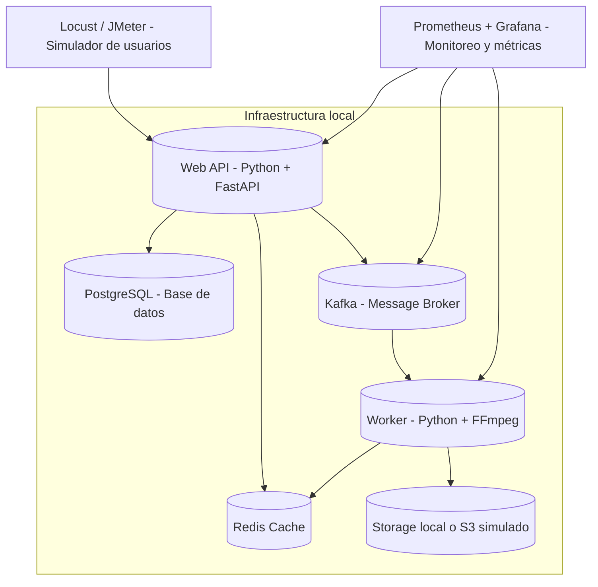

# 🧪 Plan de Pruebas – Análisis de Capacidad

## 1. Objetivo

Evaluar la **capacidad máxima** que puede soportar la aplicación en sus componentes principales (capa web y capa worker), ejecutando pruebas locales con **Docker Compose**.  
El propósito es identificar límites de **concurrencia, rendimiento y estabilidad**, establecer una línea base de desempeño y proponer acciones de mejora basadas en evidencia.

---

## 2. Objetivos específicos

| Nº | Objetivo | Métrica asociada |
|----|-----------|------------------|
| 1 | Determinar el número máximo de usuarios concurrentes soportados sin degradación. | p95 ≤ 1s, tasa de error ≤ 5% |
| 2 | Medir la capacidad de procesamiento de los workers (videos/minuto). | Throughput y tiempo medio de servicio |
| 3 | Identificar cuellos de botella en CPU, red o almacenamiento. | Métricas del host y contenedores |
| 4 | Evaluar la estabilidad bajo carga sostenida y picos repentinos. | Desviación estándar de latencia y uso de recursos |
| 5 | Documentar los resultados y recomendaciones. | Comparativa entre iteraciones |

---

## 3. Descripción general

Este plan de pruebas evalúa dos capas críticas de la aplicación:

1. **Capa Web (API HTTP):** mide la capacidad de respuesta de los endpoints principales (como la subida de archivos) con usuarios concurrentes simulados.  
2. **Capa Worker:** mide la capacidad de procesamiento asíncrono (p. ej., conversión o análisis de video) según la concurrencia de hilos y el tamaño de los archivos.

Las pruebas se ejecutarán en **entorno local** con **Docker Compose**, garantizando un aislamiento controlado y replicable del sistema bajo condiciones equivalentes a producción.

---

## 4. Tipos de pruebas

| Tipo de prueba | Objetivo | Descripción |
|----------------|-----------|--------------|
| **Capacidad** | Determinar el número máximo de usuarios concurrentes y el RPS sostenido. | Incremento progresivo de usuarios hasta detectar degradación. |
| **Carga** | Evaluar comportamiento con niveles crecientes de solicitudes. | Aumento gradual de usuarios cada minuto. |
| **Estrés** | Analizar respuesta ante sobrecarga extrema. | Incremento súbito hasta saturación. |
| **Escalabilidad** | Validar impacto de aumentar threads de worker. | Comparar throughput por configuración. |
| **Picos de estrés** | Evaluar recuperación tras picos repentinos. | Carga instantánea con alto volumen y luego estabilización. |
| **Concurrencia** | Medir impacto de múltiples accesos simultáneos a recursos compartidos. | Ejecución paralela sobre endpoints de subida y procesamiento. |

---

## 5. Criterios de aceptación

- **p95 de latencia ≤ 1 segundo.**  
- **Tasa de errores ≤ 5%.**  
- **Sin resets ni timeouts anómalos.**  
- **CPU ≤ 85% sostenido** en los contenedores de API o worker.  
- **Para workers:** la cola no debe crecer indefinidamente durante la prueba.  
- El sistema debe retornar a su estado estable tras finalizar un pico de carga.

---

## 6. Datos de prueba

- **Usuarios simulados:** 5, 50, 100, 200, 300, 400.  
- **Duración:** entre 1 y 10 minutos por escenario.  
- **Tamaños de archivo:** 50 MB y 100 MB.  
- **Mensajes en cola:** 10 a 500 por ejecución.  
- **Endpoints bajo prueba:** `/api/videos/upload`.
- **Worker:** `worker`

---

## 7. Iteraciones

Cada escenario se repetirá **mínimo 5 veces** para validar consistencia y confiabilidad.  
El promedio y desviación estándar de las métricas definirán los resultados oficiales.

---

## 8. Configuración del sistema

### Arquitectura (entorno local)

### Configuración Docker Compose

- **Servicios principales:** `web`, `worker`, `db`.  
- **Herramientas de prueba:** `locust` o `jmeter` como contenedor adicional.  
- **Base de datos:** PostgreSQL 15 con datos sintéticos.  
- **Red interna:** `docker_network: test_env`.      
- **Monitorización:** Prometheus + Grafana en contenedores auxiliares.

### Host local

- CPU: 8 núcleos (mínimo 4 dedicados a Docker).  
- RAM: 16 GB.  
- Sistema operativo: macOS / Linux.  
- Docker Engine: 27.0+  
- Docker Compose: v2.26+  

---

## 9. Herramientas utilizadas

| Herramienta | Uso | Versión |
|--------------|-----|----------|
| **Locust** | Generación de carga concurrente HTTP. | 2.31.0 |
| **Apache JMeter** | Validación y comparación de resultados. | 5.6.3 |
| **Prometheus + Grafana** | Recolección y visualización de métricas. | Prometheus 2.53.1 / Grafana 11.2 |
| **OpenTelemetry** | Trazabilidad distribuida y correlación entre componentes. | 1.25 |
| **Python script (Redis Producer)** | Inyección de mensajes en la cola. | Python 3.11 |

---

## 10. Métricas

| Medición | Métricas derivadas | Unidad |
|-----------|--------------------|---------|
| **Respuestas HTTP** | RPS, tiempo mínimo, máximo, promedio, p95, códigos 2xx/4xx/5xx. | req/s |
| **Procesamiento de videos** | Throughput (videos/min), tiempo promedio por video. | videos/min |
| **Recursos de contenedores** | CPU, memoria, IO, red. | %, MB/s |
| **Disponibilidad** | Uptime y tiempos de recuperación tras picos. | % / ms |

---

## 11. Riesgos y limitaciones

- El entorno local puede diferir de un despliegue productivo (CPU, IO o red).  
- Las pruebas no contemplan fallos externos como cortes de red o almacenamiento.  
- Los resultados pueden variar según el hardware del equipo host.  
- Los datos simulados pueden no reflejar completamente la complejidad real.  
- El uso de Docker Desktop puede introducir sobrecarga en macOS o Windows.

---

## 12. Salidas esperadas

- **Curvas**: Usuarios vs. Latencia / Errores.  
- **Gráficos**: Throughput vs. CPU / IO.  
- **Tablas**: Rendimiento por configuración de worker (threads, tamaño).  
- **Identificación**: Cuellos de botella en API o worker.  
- **Informe final**: Recomendaciones sobre escalabilidad y optimización.  

