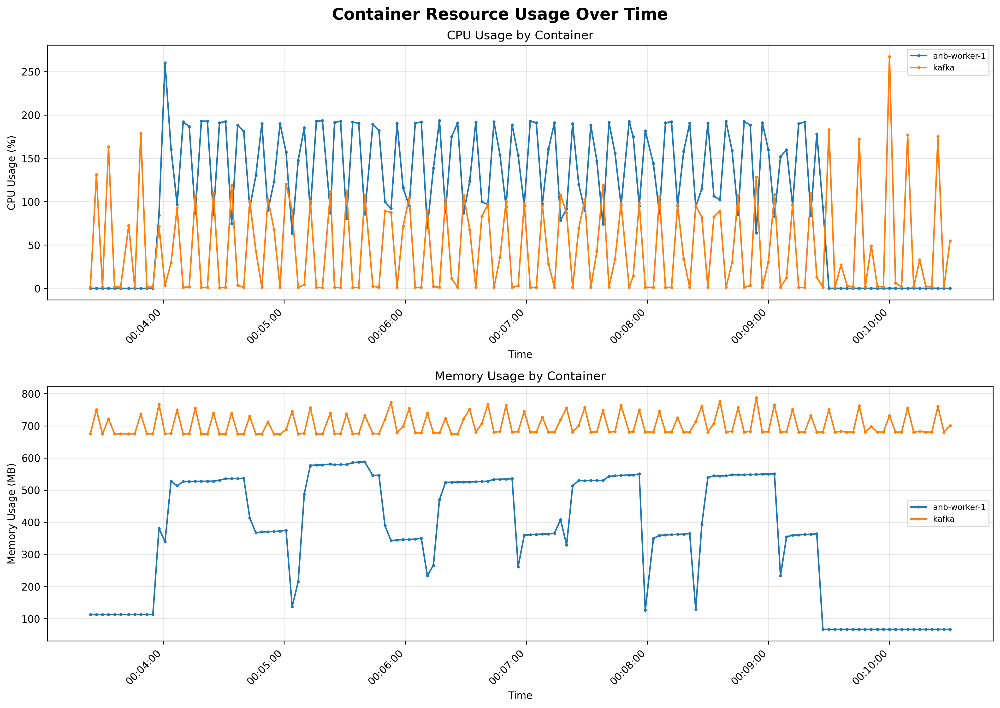
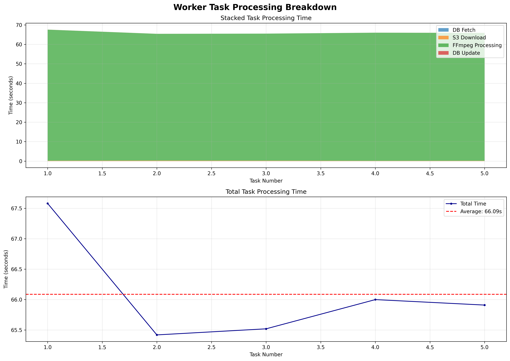
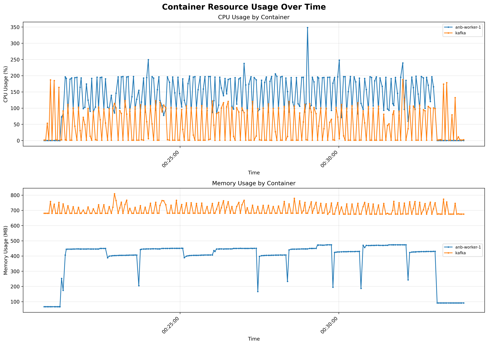
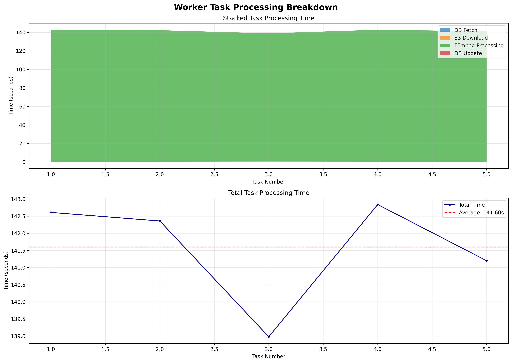
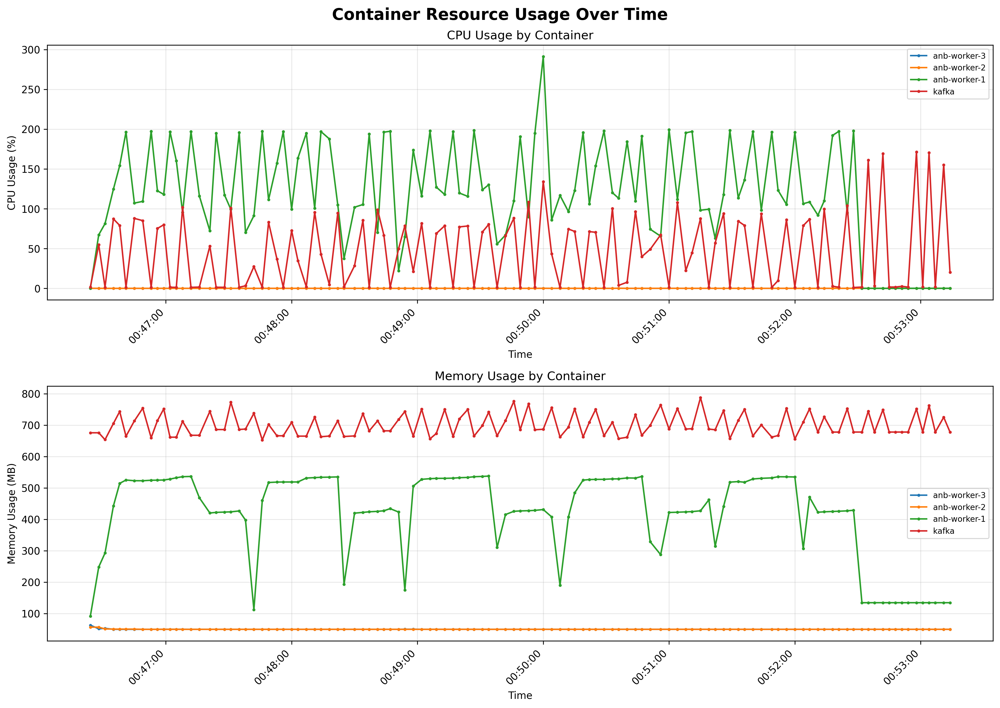
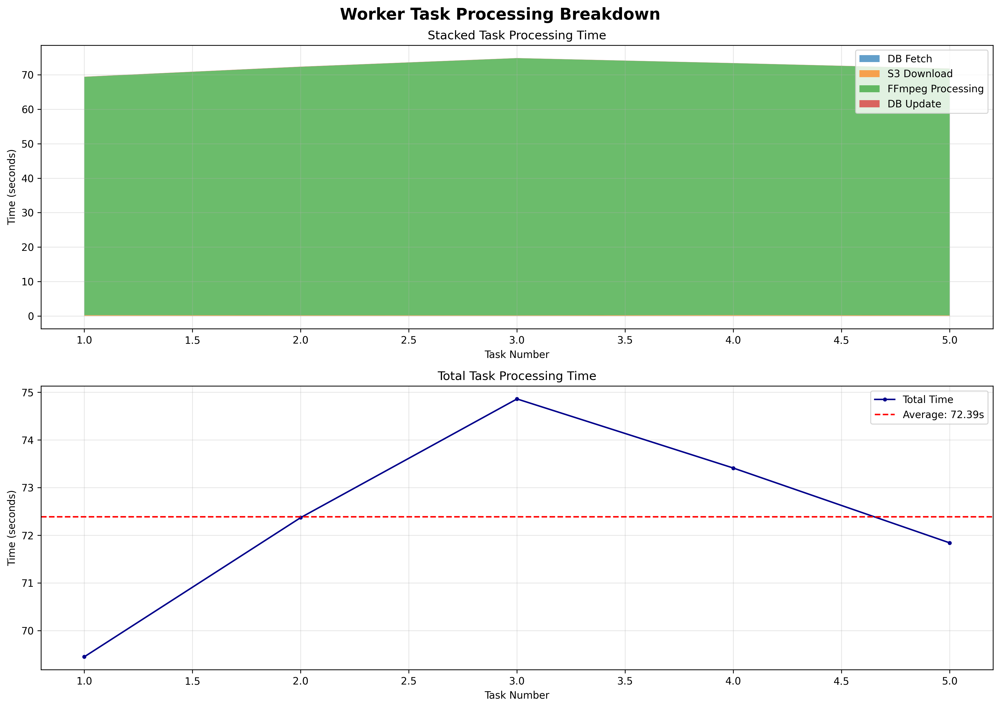
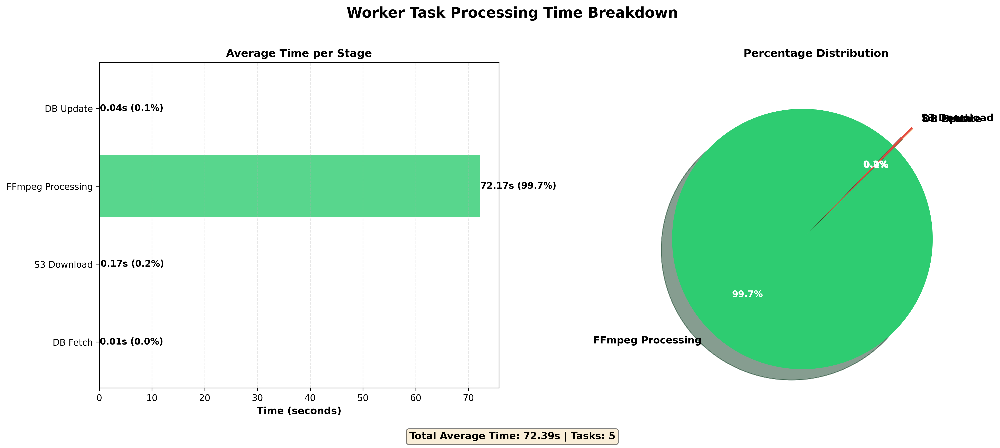
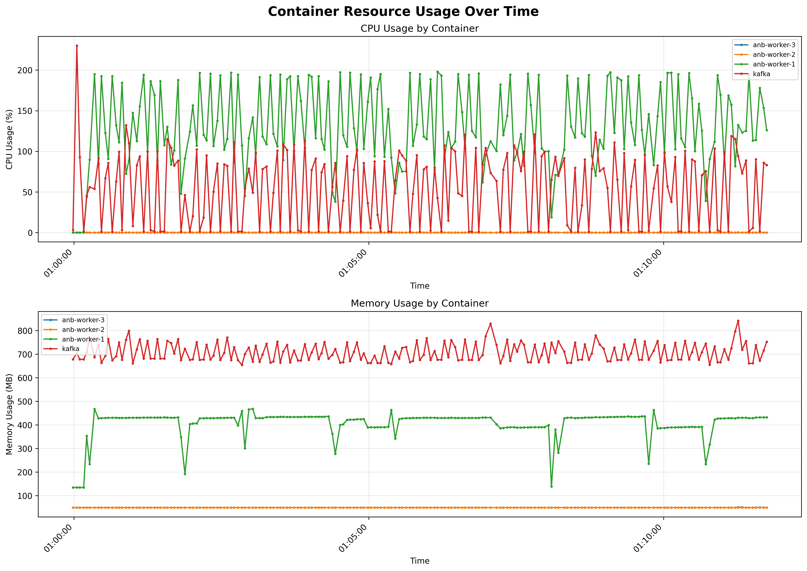
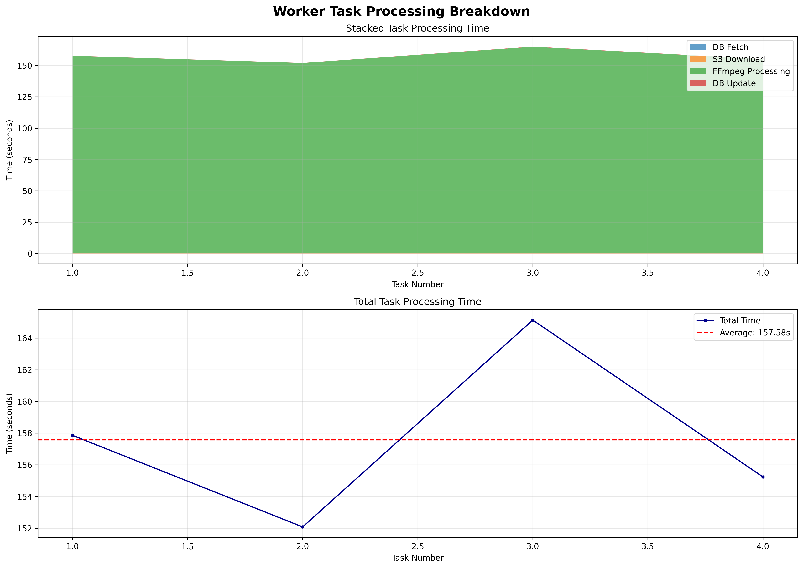

## Escenario 1 - Sanidad (Smoke):

Para este escenario inicial de sanidad, configuramos JMeter con 5 hilos (usuarios concurrentes), un periodo de ramp-up de 5 segundos y una duración total de 60 segundos. Esta configuración nos permite validar que todo el sistema responde correctamente y que la telemetría está funcionando antes de proceder con pruebas más intensivas.

La configuración de la petición incluye el endpoint de login con parámetros URL encoded para username y password, realizando una petición POST al DNS público del Application Load Balancer (ALB) que distribuye el tráfico entre las instancias EC2 del grupo de Auto Scaling donde se encuentra desplegada la aplicación.


Configuración de la petición:


### Resultados del Test de Sanidad:

Los resultados muestran que todas las peticiones fueron exitosas, lo cual es un excelente indicador de que el sistema está funcionando correctamente bajo carga básica.

**Summary Report:**
- **208 samples** procesados exitosamente
- **Tiempo promedio de respuesta:** 1,413 ms
- **Tiempo mínimo:** 433 ms
- **Tiempo máximo:** 4,380 ms
- **0% de errores** - todas las peticiones fueron exitosas
- **Throughput:** 3.4 requests/segundo


**Análisis de Percentiles:**
- **90% de las respuestas:** ≤ 1,617 ms
- **95% de las respuestas:** ≤ 1,711 ms  
- **99% de las respuestas:** ≤ 2,468 ms


**Análisis de Tiempo de Respuesta:**
El gráfico de tiempo de respuesta muestra un comportamiento bastante estable, con un pequeño pico que supera los 1,700 milisegundos, pero la mayoría de las respuestas se mantienen por debajo de este umbral. Esto indica que el sistema maneja bien la carga básica de 5 usuarios concurrentes.


**Monitoreo de Recursos del Sistema:**
El monitoreo se realizó a través de Amazon CloudWatch, el servicio nativo de observabilidad de AWS. En esta ocasión, en lugar de usar el script local calculate-stats dentro del contenedor, se aprovecharon las métricas agregadas de las instancias EC2 pertenecientes al grupo de Auto Scaling donde se encuentra desplegada la capa web.

Los resultados muestran un uso máximo de CPU del 35 %, lo cual representa un comportamiento saludable y evidencia que el sistema tiene amplio margen de capacidad disponible bajo la carga básica de cinco usuarios concurrentes.


## Escenario 1 - Escalamiento rápido (Ramp) X = 100:

Para este escenario de escalamiento rápido, aumentamos significativamente la carga para determinar el punto donde el sistema comienza a mostrar signos de degradación. Configuramos JMeter para escalar desde 0 hasta 100 usuarios concurrentes en 3 minutos, manteniendo esta carga durante 5 minutos adicionales.

### Resultados del Test con 100 Usuarios Concurrentes:

**Summary Report:**
- **1,787 samples** procesados
- **Tiempo promedio de respuesta:** 22,657 ms
- **Tiempo mínimo:** 426 ms
- **Tiempo máximo:** 33,340 ms
- **0% de errores** - todas las peticiones fueron exitosas
- **Throughput:** se mantiene estable
- **Mediana:** 27,824 ms


**Análisis de Percentiles:**
- **90% de las respuestas:** ≤ 28,583 ms
- **95% de las respuestas:** ≤ 29,801 ms
- **99% de las respuestas:** ≤ 30,439 ms


**Análisis de Tiempo de Respuesta:**
El gráfico muestra que los tiempos de respuesta aumentan significativamente a aproximadamente 30,000 milisegundos (30 segundos), lo cual indica que el sistema está comenzando a experimentar estrés bajo esta carga. Aunque no hay errores, la degradación en el rendimiento es evidente.


**Monitoreo de Recursos del Sistema:**
El análisis de recursos, monitoreado a través de Amazon CloudWatch, muestra un uso máximo de CPU del 49.8 % en la instancia que ejecuta la capa web. Este valor es particularmente interesante, ya que el umbral de autoescalado se configuró precisamente en el 50 % de utilización, por lo que el sistema no alcanzó a disparar la creación de una nueva instancia.

El gráfico de métricas confirma que el CPU se mantuvo estable justo por debajo del umbral durante toda la ejecución, sin superar el 50 %. Este comportamiento sugiere que la capacidad actual del sistema fue suficiente para manejar la carga del escenario sin requerir escalado adicional, demostrando una distribución eficiente del tráfico a través del ALB.

Además, el uso de memoria y red se mantuvo dentro de rangos normales, sin signos de saturación. En conjunto, las métricas reflejan que la infraestructura está correctamente dimensionada para este nivel de demanda, aunque cualquier incremento leve en la carga habría activado el mecanismo de Auto Scaling, añadiendo una nueva instancia para mantener el rendimiento estable.


## Escenario 1 - Escalamiento rápido (Ramp) X = 300:

Continuamos con el escalamiento, aumentando la carga a 300 usuarios concurrentes para identificar más claramente los límites del sistema.

### Resultados del Test con 300 Usuarios Concurrentes:

**Summary Report:**
- **1,901 samples** procesados
- **Tiempo promedio de respuesta:** 68,657 ms (aproximadamente 69 segundos)
- **Tiempo mínimo:** 535 ms
- **Tiempo máximo:** 93,516 ms
- **0% de errores** - todas las peticiones fueron exitosas
- **Throughput:** 3.3 requests/segundo
- **Mediana:** 87,646 ms


**Análisis de Percentiles:**
- **90% de las respuestas:** ≤ 90,761 ms
- **95% de las respuestas:** ≤ 92,577 ms
- **99% de las respuestas:** ≤ 93,230 ms


**Análisis de Tiempo de Respuesta:**
El gráfico de tiempo de respuesta muestra que efectivamente los tiempos suben a aproximadamente 90,000 milisegundos (90 segundos) después de los 3 minutos de rampa. Esta degradación significativa indica que el sistema está operando muy cerca de sus límites máximos.


**Monitoreo de Recursos del Sistema:**
El análisis de recursos muestra un uso promedio de CPU del 100.71% en el contenedor storeapi, lo cual indica que el sistema está operando al límite de su capacidad. El gráfico de recursos del contenedor muestra el mismo comportamiento que el escenario anterior, con el CPU manteniéndose al 100% y picos ocasionales que llegan hasta el 160%.


Descargamos la imagen generada con secure copy:

```bash
scp -i "ANB.pem" ubuntu@{{ip}}:/home/ubuntu/anb/capacity-planning/postman/results/container_resources.png ./container_resources.png
```


## Escenario 1 - Escalamiento rápido (Ramp) X = 500:

En este escenario crítico, aumentamos la carga a 500 usuarios concurrentes para identificar el punto de fallo del sistema.

### Resultados del Test con 500 Usuarios Concurrentes:

**Summary Report:**
- **2,157 samples** procesados
- **Tiempo promedio de respuesta:** 107,183 ms (aproximadamente 107 segundos)
- **Tiempo mínimo:** 254 ms
- **Tiempo máximo:** 344,100 ms
- **1.25% de errores** - aquí comenzamos a ver fallos en el sistema
- **Throughput:** se mantiene en 3.4 requests/segundo
- **Mediana:** 139,466 ms


**Análisis de Percentiles:**
- **90% de las respuestas:** ≤ 146,951 ms
- **95% de las respuestas:** ≤ 147,586 ms
- **99% de las respuestas:** ≤ 147,863 ms


**Análisis de Tiempo de Respuesta:**
El gráfico muestra tiempos de respuesta promedio de aproximadamente 140,000 milisegundos (140 segundos). Es interesante observar un pico descendente después de los 2 minutos y medio (después de la rampa de 3 minutos), lo cual probablemente se debe a la degradación de los servicios que comienzan a fallar y por tanto responden más rápido con errores.


**Monitoreo de Recursos del Sistema:**
El análisis de recursos muestra un uso promedio de CPU del 99.76% en el contenedor storeapi. Es curioso notar que aunque este escenario presenta degradación con errores, el uso de CPU es ligeramente menor que en el escenario de 300 usuarios (que no tuvo errores pero sí alcanzó el 160% en algunos picos). El gráfico de recursos del contenedor muestra el mismo comportamiento, con picos que llegan hasta el 140%.


Descargamos la imagen generada con secure copy:

```bash
scp -i "ANB.pem" ubuntu@{{ip}}:/home/ubuntu/anb/capacity-planning/postman/results/container_resources.png ./container_resources.png
```


## Escenario 1 - Sostenida corta (300 * 0.8 = 240):

Para el escenario de sostenida corta, utilizamos el 80% de la carga máxima que no presentó errores (300 usuarios), es decir, 240 usuarios concurrentes. Este test nos permite confirmar la estabilidad del sistema bajo una carga sostenida.

### Resultados del Test de Sostenida Corta con 240 Usuarios:

**Summary Report:**
- **1,261 samples** procesados
- **Tiempo promedio de respuesta:** 59,747 ms (aproximadamente 60 segundos)
- **Tiempo mínimo:** 648 ms
- **Tiempo máximo:** 73,171 ms
- **0% de errores** - todas las peticiones fueron exitosas
- **Throughput:** 3.8 requests/segundo
- **Mediana:** 69,539 ms


**Análisis de Percentiles:**
- **90% de las respuestas:** ≤ 71,299 ms
- **95% de las respuestas:** ≤ 72,284 ms
- **99% de las respuestas:** ≤ 72,911 ms


**Análisis de Tiempo de Respuesta:**
El gráfico muestra tiempos de respuesta promedio de aproximadamente 72,000 milisegundos (72 segundos), pero con un comportamiento estable. Aunque el tiempo de respuesta promedio es considerablemente alto, el sistema mantiene la estabilidad sin errores bajo esta carga sostenida.


**Monitoreo de Recursos del Sistema:**
El análisis de recursos muestra un uso promedio de CPU del 90% en el contenedor storeapi. El gráfico de recursos del contenedor muestra el mismo comportamiento observado en los escenarios anteriores: el CPU se mantiene al 100% con picos ocasionales que llegan hasta el 140%.


Descargamos la imagen generada con secure copy:

```bash
scp -i "ANB.pem" ubuntu@{{ip}}:/home/ubuntu/anb/capacity-planning/postman/results/container_resources.png ./container_resources.png
```


## Conclusiones del Escenario 1 - Capacidad de la Capa Web:

### Capacidad Máxima Identificada:
Basándonos en los resultados de las pruebas, podemos concluir que:

- **Capacidad máxima sin errores:** 300 usuarios concurrentes
- **Punto de degradación:** Entre 300 y 500 usuarios concurrentes
- **Punto de fallo:** 500 usuarios concurrentes (1.25% de errores)

### Análisis de SLOs:
- **p95 de endpoints:** En el escenario de 300 usuarios, el p95 fue de 92,577 ms, lo cual excede significativamente el SLO de ≤ 1 segundo
- **Errores:** El sistema mantiene 0% de errores hasta 300 usuarios, pero comienza a fallar en 500 usuarios
- **Bottleneck identificado:** El CPU del contenedor storeapi es claramente el cuello de botella, operando constantemente al 100% con picos hasta el 160%

### Recomendaciones:
1. **Escalado horizontal:** Implementar múltiples instancias del API para distribuir la carga
2. **Optimización de CPU:** Revisar y optimizar el código para reducir el uso de CPU
3. **Monitoreo proactivo:** Establecer alertas cuando el CPU supere el 80% para escalar automáticamente
4. **Capacidad recomendada:** Para producción (con esta configuración), no exceder 240 usuarios concurrentes (80% de la capacidad máxima sin errores)


## Escenario 2 50Mb-1 Worker - 5 Tasks

  **Recursos de Contenedores:**
  
  

  **Tiempos de Worker:**
  
  

  **Desglose de Procesamiento:**
  
  


## Escenario 2 100Mb-1 Worker - 5 Tasks

  **Recursos de Contenedores:**
  
  

  **Tiempos de Worker:**
  
  

  **Desglose de Procesamiento:**
  
  


## Escenario 2 50Mb-3 Worker - 5 Tasks

  **Recursos de Contenedores:**
  
  

  **Tiempos de Worker:**
  
  

  **Desglose de Procesamiento:**
  
  


## Escenario 2 100Mb-3 Worker - 5 Tasks

  **Recursos de Contenedores:**
  
  

  **Tiempos de Worker:**
  
  

  **Desglose de Procesamiento:**
  
  


## Conclusiones del Escenario 2 - Capacidad de la Capa Worker:

### Capacidad Máxima Identificada:
Basándonos en los resultados de las pruebas, podemos concluir que:

- **Capacidad máxima sin errores:** 5 Tasks 3 Workers 50MB File
- **Punto de degradación:** Desde el inicio no cumple con los requirimientos ya que se demora mas de 60s por video
- **Punto de fallo:** Tasks 3 Workers 100MB File Se perdio un video en su procesamiento
- *Procesamiento*: 1 vid/min - 50MB File y 0.5 vid/min - 100MB File

### Comentarios:
El worker se comporto desde el inicio con un solo video de forma demorada se demoro mas de 60s procesando un solo video. En la prueba anterior En pruebas locales con mejores maquinas se procesaban varios videos por minuto.

Al paralerizar workers por procesos si lo vemos de esa forma al uso de mas de un container en la misma maquina vemos que pelean por recursos ya que el procesamiento de video es una tarea de alto consumo de CPU y que se hace de forma sincrona.

Adicionalmente entre mas pesado el video mas demora tomaba su edicion visto en las graficas para videos de 100MB las cuales triplican la demora de un video de 50MB.
