# Flujo de Procesos — Entrega 4

En esta entrega se actualiza el flujo para reflejar la arquitectura con **ALB + Target Group**, **ASG Web**, **ASG de Workers**, **Amazon SQS con DLQ**, **Amazon S3**, **Amazon RDS (PostgreSQL)** y **Amazon CloudWatch (métricas + alarmas)**.  
El despliegue opera en al menos **dos zonas de disponibilidad (multi‑AZ)** para alta disponibilidad.

---

## ⚙️ Descripción del flujo

1. El **usuario (Jugador/Jurado)** realiza una solicitud HTTP/HTTPS (p. ej., subir un video).  
2. El **ALB** enruta la petición al **Target Group (Web)**, que dirige a una instancia saludable del **ASG Web** donde corre la API FastAPI (`storeapi`).  
3. La API guarda el archivo en **Amazon S3** (`videos/uploaded/...`) y publica un mensaje en **Amazon SQS (video-processing-queue)** con los metadatos necesarios.  
4. El **ASG de Workers** escala en función de las métricas de SQS (tamaño del backlog/edad del mensaje). Una instancia worker:
   - Consume el mensaje de **SQS** (ReceiveMessage)
   - Descarga el video de **S3**
   - Procesa el video (FFmpeg) y sube el resultado a `videos/processed/...` en **S3**
   - Actualiza el estado del video en **RDS** y elimina el mensaje de **SQS** (DeleteMessage)
5. Si el procesamiento falla repetidamente, el mensaje se envía a la **DLQ de SQS** para diagnóstico y re‑proceso controlado.  
6. **CloudWatch** recolecta métricas y dispara **Alarms** que ajustan la capacidad de:
   - **ASG Web** (CPU, RequestCountPerTarget, 5xx, UnHealthyHostCount)
   - **ASG Workers** (ApproximateNumberOfMessagesVisible, ApproximateAgeOfOldestMessage)

---

## 📈 Diagrama de secuencia (Mermaid)

```mermaid
sequenceDiagram
    autonumber
    actor U as Usuario (Jugador/Jurado)
    participant ALB as Application Load Balancer (ALB)
    participant WEB as FastAPI (ASG Web - Target Group)
    participant SQS as Amazon SQS (video-processing-queue)
    participant DLQ as Amazon SQS (DLQ)
    participant WRK as Worker (ASG Workers)
    participant S3 as Amazon S3
    participant RDS as Amazon RDS (PostgreSQL)
    participant CW as Amazon CloudWatch

    rect rgba(200,200,255,0.15)
    Note over ALB,WEB: Multi‑AZ (≥2 subnets) con health checks en Target Group
    end

    U->>ALB: POST /api/videos/upload
    ALB->>WEB: Redirige solicitud
    WEB->>S3: PutObject (video original → uploaded/)
    WEB->>SQS: SendMessage({ video_id, user_id, task_id })

    par Escalado por carga
      CW-->>WEB: Métricas ALB/TG (CPU, 5xx, RPS)
      CW-->>WRK: Métricas SQS (backlog/age)
    end

    WRK->>SQS: ReceiveMessage
    alt Mensaje válido
      WRK->>S3: GetObject (video original)
      WRK->>S3: PutObject (video procesado → processed/)
      WRK->>RDS: UPDATE videos SET status='processed', processed_url=...
      WRK->>SQS: DeleteMessage
    else Reintentos agotados
      SQS-->>DLQ: Move to DLQ
    end

    Note over CW: Alarms → Policies de Auto Scaling (Web y Workers)
```

---

## 🧠 Beneficios del flujo actualizado

- **Desacoplamiento y resiliencia** con SQS + DLQ entre la capa web y los workers.  
- **Elasticidad** de Web/Workers con políticas de autoescalado basadas en métricas reales.  
- **Alta disponibilidad** al operar en múltiples AZ y usar health checks del Target Group.  
- **Observabilidad** con métricas y alarmas de **CloudWatch** para capacidad y errores.  

---

## 🔎 Notas de implementación

- Los workers deben ejecutar un servicio al arranque (Launch Template) que inicialice el consumidor SQS.  
- Las políticas de escalado recomendadas:
  - Web: CPU ≥ 60%, RequestCountPerTarget, tasa de 5xx/UnHealthyHostCount.
  - Workers: `ApproximateNumberOfMessagesVisible` y `ApproximateAgeOfOldestMessage`.
- En caso de error, la **DLQ** conserva el mensaje con contexto para análisis posterior y reprocesamiento manual.

 # Flujo de Procesos

El siguiente diagrama representa el flujo general de la aplicación **ANB Rising Stars Showcase** en la arquitectura actual desplegada en AWS.  
En esta versión se reemplazó el servidor NFS por **Amazon S3**, y la carga de trabajo de la API se distribuye a través del **Application Load Balancer (ALB)** y un **Auto Scaling Group** con instancias EC2.  
El procesamiento de los videos se sigue manejando de forma asíncrona por medio del **WorkerServer**, que consume tareas desde **Kafka**.

---

## ⚙️ Descripción del flujo

1. El **Jugador o Jurado** realiza una solicitud HTTP/HTTPS (por ejemplo, subir un video).  
2. El **ALB** recibe la petición y la dirige a una instancia disponible dentro del **Auto Scaling Group**, donde se ejecuta la API FastAPI (`storeapi`).  
3. La API guarda el video original en **Amazon S3** (carpeta `/videos/uploaded`) y crea una tarea en **Kafka** para que el Worker la procese.  
4. El **WorkerServer** toma la tarea desde Kafka, descarga el archivo de S3, aplica los pasos de procesamiento (recorte, marca de agua, etc.) y sube el resultado a **S3** (carpeta `/videos/processed`).  
5. El Worker actualiza el estado del video en la base de datos **Amazon RDS (PostgreSQL)**.  
6. **CloudWatch** monitorea las métricas del ALB y de las instancias EC2 para ajustar automáticamente la cantidad de servidores en el Auto Scaling Group según la demanda.

---

## 🧠 Beneficio del nuevo flujo

Este nuevo flujo elimina la dependencia del FileServer, reduce los puntos de falla y permite escalar dinámicamente la capa web, garantizando mejor desempeño incluso con muchos usuarios concurrentes.

---

## 📈 Diagrama del flujo de procesos

